# Documentación

**Índice.**

1.[Herramientas](#herramientas-a-usar).

2.[Integración continua Travis](#integraci%c3%b3n-continua).

3.[Integración continua circleci](#integraci%c3%b3n-continua-opcional).

4.[Integración continua jenkis](#integraci%c3%b3n-continua-local).

5.[Herramienta de construcción](#herramienta-de-construcci%c3%b3n).

6.[Paas Heroku](#paas-heroku)

7.[PaaS Azure](#paas-azure)

8.[Docker](#docker)

9.[Provisionamiento](#provisionamiento-con-ansible)

**Enlace rápido a las distintas secciones a parte.**

1-  [Herramientas](/doc/herramientas.md).

2- [Integración continua Travis](/doc/travis.md).

3- [Integración continua circleci](/doc/circleci.md).

4- [Integración continua jenkis](/doc/jenkins.md).

5- [Herramienta de construcción](/doc/herramienta_construcción.md).

6- [Documentación clases](/doc/doc_clases.md)

7- [Documentación Heroku](/doc/heroku.md)

8- [Documentación Azure](/doc/azure.md)

9- [Despliegue docker](/doc/docker.md)

10- [Provisionamiento](/doc/doc_provision.md)
## Herramientas a usar

### Lenguaje

- El lenguaje que se va a usar es [Python](https://www.python.org/) un lenguaje que tiene tipado dinámico, esto quiere decir que el tipo de dato dependerá de la asignación de la variable, personalmente me gusta, es familiar ya que lo he cursado en otras asignaturas y también existe mucha documentación que facilita el aprendizaje y la resolución de errores.
  
### Framework
- El framework que voy a usar es [hug](http://www.hug.rest/) lo vi el curso pasado y me resultó simple de usar por los pocos pasos que hay que seguir para que funcione como son las configuraciones, instalación y uso. Además en la documentación viene con ejemplos fácil de seguir y para el desarrollo con Python me parece muy adecuado para mi proyecto.
  
### Gestor de base de datos
- Para la base de datos voy a utilizar [Postgresql](https://www.postgresql.org/) me parece muy adecuado ya que existe bastante documentación y quiero aprender a usar una base relacional de código abierto. También documentándome por la web vi que para un alto volumen de datos el rendimiento con otras bases de datos es mayor, por lo que para un futura continuación del proyecto me parece muy atractivo.  

### Logs
- Para el login de los usuarios y los logs haré uso de la biblioteca de python [loggin](https://docs.python.org/3/library/logging.html) que permitirá el correcto registro de mensajes para el microservicio.
  
### Test

- Para comprobar el correcto funcionamiento se hará uso de test, para ello se usará [Pytest](https://docs.pytest.org/en/latest/) Además haremos uso del servicio de integración continua [Travis](https://travis-ci.org/) que se configurará para este repositorio. Es una herramienta fundamental para comprobar que el desarrollo de nuestro servicio, ya que nos permite integrar fácilmente con Github ejecutando el pipeline definido en cada push o pull request. Nos permitirá testear por completo nuestra aplicación para después en el despliegue no tener ninguna sorpresa.

- Adicionalmente para hacer más clara y tener mejor organizada la documentación se ha hecho un [repositorio](https://github.com/juaneml/doc_IV-1920_Proyecto) para hacer uso de [hg-pages](https://pages.github.com/).

## Integración Continua

## [Travis](https://travis-ci.org/) 

- Servicio que proporciona la integración continua.
  - Este servicio permite ejecutar tests de nuestro repositorio en Github.
  - Los pasos son muy sencillos y son:
    - Nos registramos con nuestra cuenta de Github.
    - Creamos en el repositorio donde queremos tener la integración continua un archivo con el nombre [.travis.yml](https://github.com/juaneml/IV_1920_Proyecto/blob/master/.travis.yml),

    Fichero .travis.yml
    ~~~
    language: python

        python:
        - "3.7"

        # command to install dependencies
        install:
        - pip3 install -r requirements.txt
        - pip3 install codecov
        - pip3 install pytest-cov
        - pip3 install python-coveralls
        - pip3 install coveralls
        services:
        - postgresql
            
        before_script:
        - psql -c 'create database travis_ci_test;' -U postgres
        
        
        # command to run tests
        script: 
        - cd ./test && pytest -v test.py 
        - coverage run test.py
        - coverage report -m
        - coverage xml

        after_success:
        - bash <(curl -s https://codecov.io/bash) -t d0ba6a02-f9f7-44ab-b128-a82396d54280 -f coverage.xml

    ~~~     
     
  - Vamos a describir este archivo:
    - language: lenguage de programación usado, en mi caso [python](https://www.python.org/), versión 3.7. 
    - Los comandos para instalar las depencecias:
      - con pip3 install instalamos:
        - [requirements.txt](https://github.com/juaneml/IV_1920_Proyecto/blob/master/requirements.txt),requisitos que necesitamos.
        - [codecov](https://codecov.io/), una herramienta de integración para comparar la cobertura de nuestro código.
        - [coverage](https://coverage.readthedocs.io/en/v4.5.x/), para medir la cobertura de los programas programados en python, nos permitirá ver el seguimiento del uso de las distintas funciones, es decir el uso en la aplicación de los distintos test.
        - [coveralls](https://coveralls.io/), otra herramienta para la cobertura de nuestro código, que posteriormente se hará uso.
        - y por último incluimos la instrucción de pytest para la ejecución de test de nuestro proyecto.
        - Se activa el servicio de postgreSql que posteriormente se hará uso.
        - Con ***psql -c***  , se crea una base de datos.
        - pytest para el uso de test.
        - coverage run nombre del test, para aplicar la cobertura a nuestro test.
        - coverage report -m, que nos mostrará la cobertura de nuestro código
        - coverage xml, para crear nuestro reporte.
        - bash <(curl -s https://codecov.io/bash) -t codec_token -f nombre_archivo.xml para subir nuestro reporte y poder seguirlo en la la web de [codecov](https://codecov.io/).
        
    - Una vez configurado nuestro archivo .travis.yml vamos a la web de travis.   
    - En el panel de Travis activamos nuestro proyecto
     
    
    - En la pestaña Dashboard podremos ver nuestro repositorio activo.
    - Para poder verlo con más detalle lo seleccionamos y veremos si ha ido todo bien o hemos tenido algún error.
    - Si todo ha ido bien tendremos una salida como esta:

   

## Integración continua opcional

## [circleci](https://circleci.com/)

- Como sistema de integración continua opcional se ha elegido [circleci](https://circleci.com/).
  
- Para poder hacer uso del servicio de circleci vamos a la página de [circleci](https://circleci.com/).

### 1. Registro

- Nos creamos una cuenta con la cuenta de github.

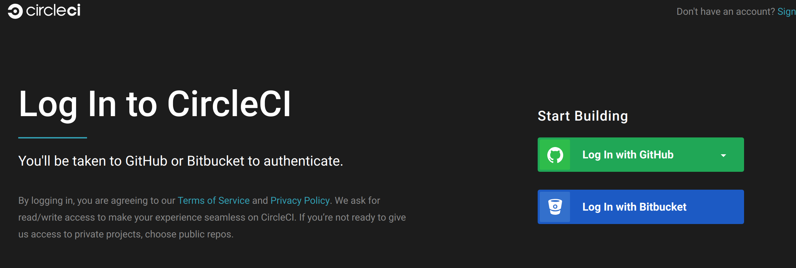

### 2. Añadimos el proyecto

- Una vez iniciamos sesión vamos a sección "add projects" botton `+` y añadimos el proyecto al que queremos hacer el seguimiento, pulsamos "**Set up Proyect**".
 

- Veremos algo como esto
  
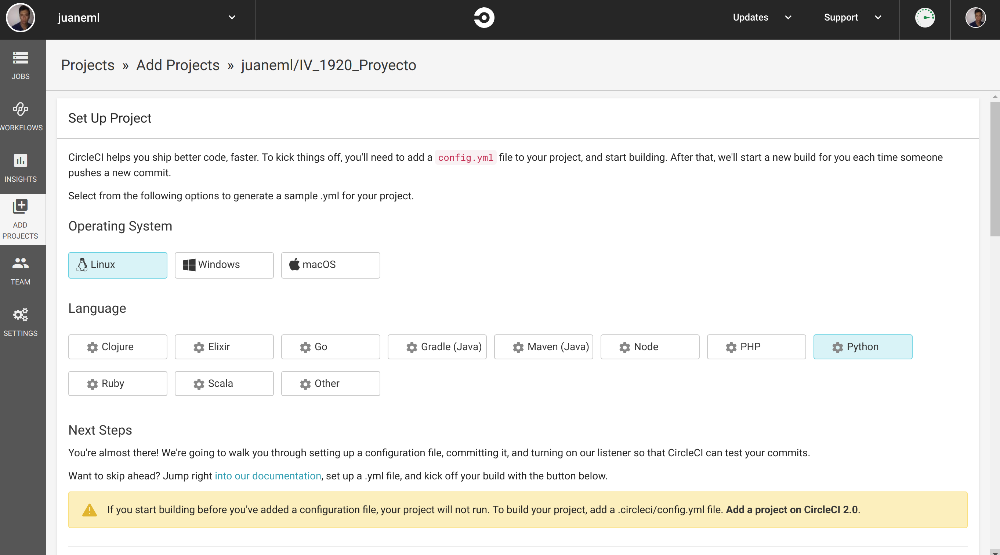  

- Elegimos el sistema operativo, en mi caso Linux.
- Elegimos el lenguage de programación, en mi caso Python.

### 3. Configuración archivo `.circleci/config.yml` 

- A continuación, segimos la instruciones en pantalla para crear el archivo `config.yml`. 

- Dentro de nuestro repositodio creamos una carpeta con el nombre `.circleci` y dentro de la carpeta creamos el archivo `config.yml`

- Para la creación de la carpeta y el archivo podemos hacerlo de dos formas en la página de Github situandonos en la raíz de nuestro repositorio o bien si tenemos clonado nuestro reposotorio en nuestro lugar de trabajo local.

- Voy a optar por la segunda opción por tanto abrimos un terminal y ejecutamos las siguientes intrucciones:
  ~~~
  mkdir .circleci 
  vi .circleci / config.yml
  ~~~

- Mi configuración del archivo config.yml es así:
  ~~~
     
  ##
  # Check https://circleci.com/docs/2.0/language-python/ 
  ##
  version: 2
  jobs:
  build:
    docker:
      - image: circleci/python:3.7-rc-node
     
    working_directory: ~/prueba_travis
    steps:
      - checkout
       # Download and cache dependencies
      - restore_cache:
          keys:
            - v1-dependencies-{{ checksum "requirements.txt" }}
            # fallback to using the latest cache if no exact match is found
            - v1-dependencies-
 
      - run: sudo pip3 install -r requirements.txt
      - run: sudo npm install npm-install-all -g
      - run: sudo npm install pm2 -g
     
      - run:
          name: init app
          command: make start
      
      - run:
          name: status app
          command: make status
      
      - run:
          name: tests
          command: make -B test     
      
      - run:
          name: stop app
          command: make stop

      - run:
          name: delete app
          command: make delete
 

 
  ~~~
- Pasamos a explicar, la configuración del archivo config.yml,

- Primero definimos la imagen que en mi caso es un contenedor con ubuntu y como lenguaje python 3.7.
- Resturamos la cache del contenedor.
- Instalamos el fichero requirements.txt
- Instalamos el gestor nmp para poder instalar el gestor de tareas pm2.
- Instalamos el gestor de tareas pm2.
- Haciendo uso de make , `make start` iniciamos el servicio.
- Con `make status`, vemos el estado del servicio.
- Para ejecutar los test hacemos `make -B test` la opción `-B` para forzar que se hagan los test.
- Para parar el servio `make stop`.
- Para borrar el servicio del gestor de tareas hacemos uso de `make delete`
  

## Salida circleci
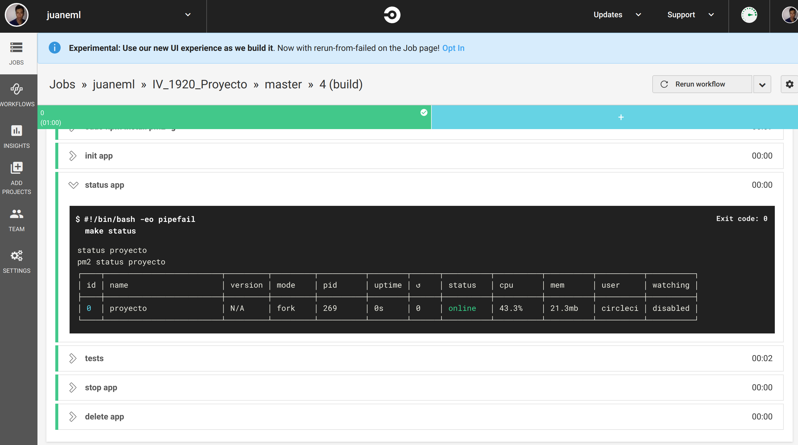

## Integración continua local  

## [Jenkins](https://jenkins.io/)

- Opcionalmente se ha instalado otro sistema de integración continua que usaremos de forma local.
  
- Para poder hacer uso del servicio de Jenkins vamos a la página de [Jenkins](https://jenkins.io/)
- Abrimos un terminal y ejecutamos las siguientes instrucciones: 
***
    wget -q -O - https://pkg.jenkins.io/debian/jenkins.io.key | sudo apt-key add -

    sudo sh -c 'echo deb https://pkg.jenkins.io/debian-stable binary/ > /etc/apt/sources.list.d/jenkins.list'

    sudo apt-get update

    sudo apt-get install jenkins

***
- Para más información puedes consultar la documentación facilitada pof [Jenkis doc](https://jenkins.io/doc/book/installing/) 
  
- Una vez instalado vamos a nuestro navegador y escribimos: 
***
    localhost:8080
***

- Obtendremos una salida parecida a esta:

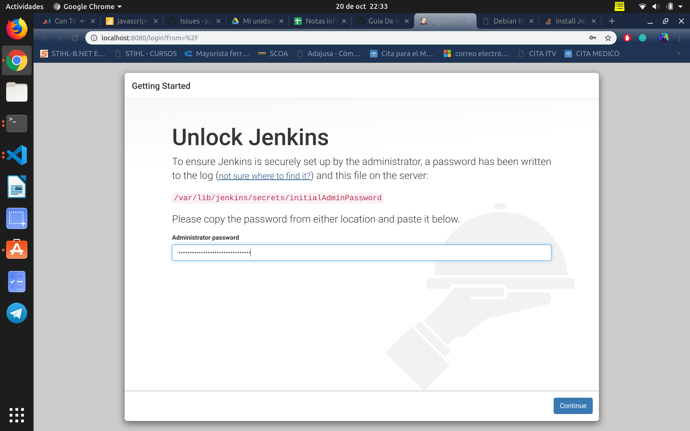

- Vamos a un terminal y ejecutamos:
***
    cat /var/lib/jenkins/secrets/initialAdminPassword

Para obtener la contraseña inicical que nos viene por defecto en Jenkins.
***

- Hacemos la instancia de la configuración.
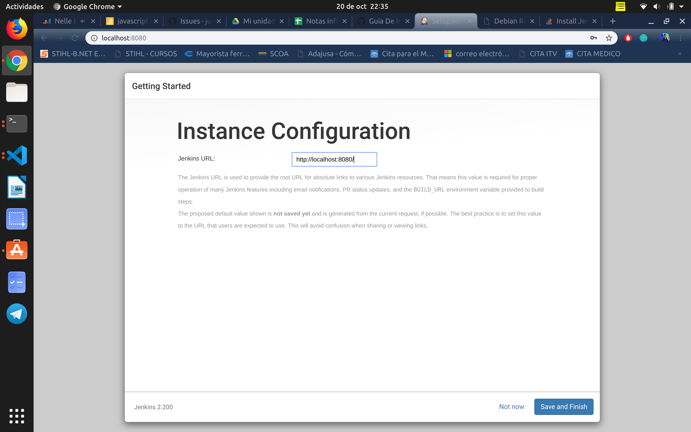
- Lo dejamos como viene.
- Creamos  un usuario:
- 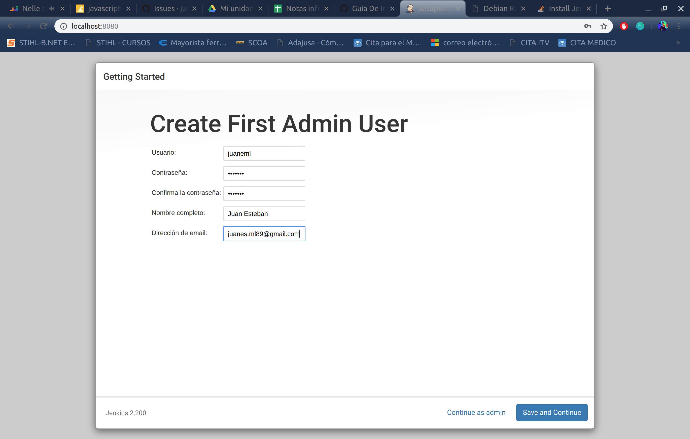

- Al finalizar obtendremos la siguiente salida.
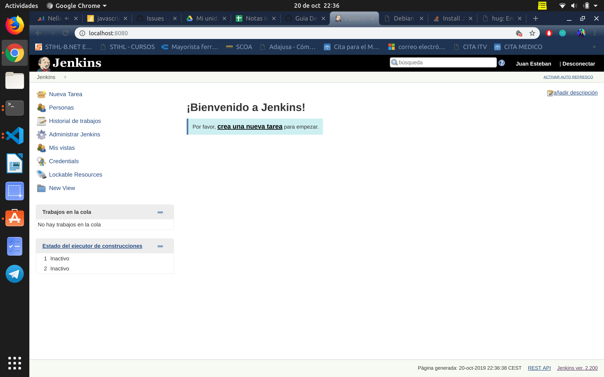

- Creamos una tarea con el nombre que deseamos en mi caso multibranck Pipeline.
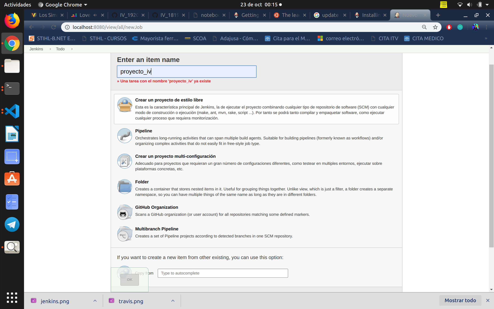

- En Branck Sources añadimos nuetro respositorio con las credenciales.
- Build Configuration Jenkinsfile.
- Si deseamos que se ejecute cada cierto tiempo tenemos la opcion, Scan Multibranck Pipeline Triggers con el intervalo de tiempo. Finalizada la configuración guardamos.
- Vamos a nuestro repositorio de Github y creamos un archivo con el nombre [JenkinsFile](https://github.com/juaneml/IV_1920_Proyecto/blob/master/Jenkinsfile) con los test que queremos que realice.
  
- Construimos la tarea y una vez finalizada obtendremos una salida como esta:
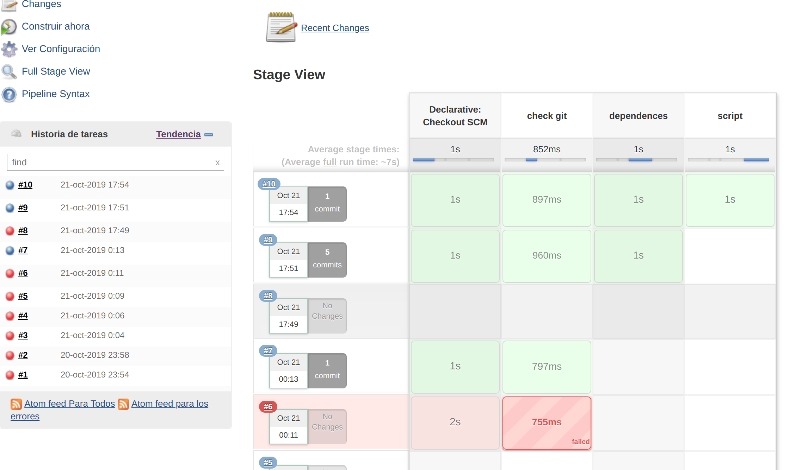

- Donde podemos ver los resultados.
- También tenemos la opción de ver los logs con los resultados de nuestros test a la tarea.
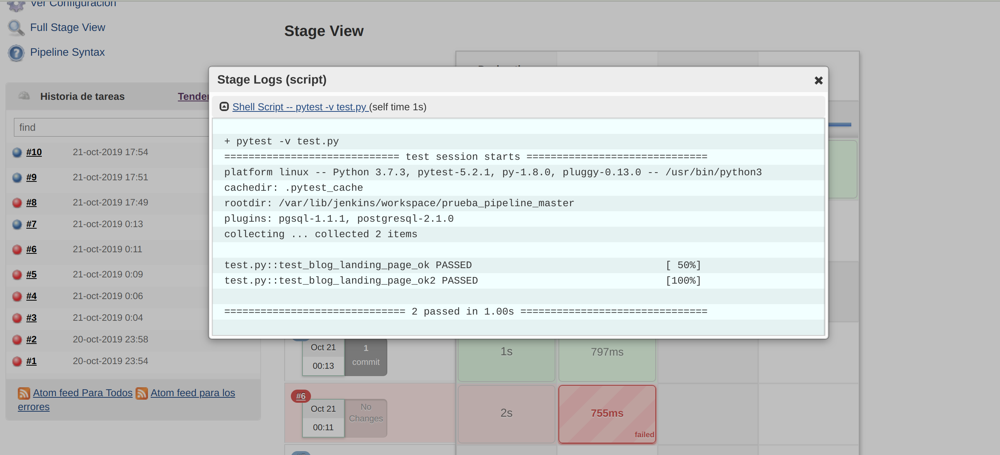

# Herramienta de construcción
- Hemos definido una herramienta de construcción
[Makefile](https://github.com/juaneml/IV_1920_Proyecto/blob/master/Makefile)

~~~
dependences:
	@echo "Makefile microservicio\n"
	@echo "language: python version 3.7 \n"
	

	@cho "npm install and pm2"
	npm install npm-install-all -g
	npm install pm2 -g

	@echo "install dependences"
	pip3 install -r requirements.txt

test: 
	@echo "run tests"
	cd ./test && pytest --cov=test	test.py test_app.py
	cd ./test && coverage run -p --source=test test.py 
	cd ./test && coverage report -m
	cd ./test && coverage xml 
	cd ./test && coverage run -p --source=test_app test_app.py 
	cd ./test && coverage report -m
	cd ./test && coverage xml -o coverage1.xml
	cd ./test && coverage combine
	cd ./test && coverage xml
	
	
codecov:
	@echo "codecov"
	cd ./test && bash <(curl -s https://codecov.io/bash) -t d0ba6a02-f9f7-44ab-b128-a82396d54280 -f coverage.xml
	cd ./test && coveralls

start:
	@echo "Iniciamos la appp puerto 80000"
	cd ./src; pm2 start 'gunicorn proyecto_app:__hug_wsgi__ -b 0.0.0.0:8000' --name proyecto

status:
	@echo "status proyecto"
	pm2 status proyecto

monitor:
	@echo "monitor logs, custom metrics, application information"		
	pm2 monit

stop:
	@echo "stop app"
	pm2 stop proyecto 

logs_repo:
	@echo "logs repo"
	git log > logs_repo.txt

delete:
	@echo "delete proyecto in pm2"
	pm2 delete proyecto

~~~
con las siguientes características:
- Para imprimir mensajes por pantalla hacemos uso de echo. 
  
- dependences:
  - Instalamos el gestor de tareas pm2 pero previamente instalamos npm para poder instalar pm2.
   
  - Instalamos las dependencias necesarias como las que tenemos en requirements.txt
  
- Test: 
    - Lanzará los test y cobertura del código así como dos reportes xml después los combinaremos con ` coverage combine`.
    - Vamos a explicar las opciones puestas en coverage.
    - `coverage run -p --source=test`, `-p` nos permite combinarlo con otro reporte, `-source` determinamos el código al que queremos hacer la cobertura sin .py y por último el `archivo.py`.

    - Tenemos dos test:
    - [test.py](/test/test.py) hace test al código python necesario para nuestro servicio
    - [test_app.py](/test/test_app.py), se aplican test al servicio, haciendo uso de nuestro [Framework Hug](https://www.hug.rest/), como la comprobación de que se muestra el contenido deseado en las distintas urls definidas.
    
- codecov:
  - Tendremos la cobertura de nuestro código, es decir el uso que se ha obtenido del código que queremos aplicar la cobertura, en nuestro caso los test.
  - 

- start: 
  - Inicia con el gestor de tareas pm2 y con gunicorn, una herramienta que nos permite desplegar de forma local nuestra aplicación.

  - Lanzamos nuestra aplicación: `cd ./src; pm2 start 'gunicorn proyecto_app:__hug_wsgi__ -b 0.0.0.0:8000' --name proyecto`
  
  ~~~
    make start
  ~~~

  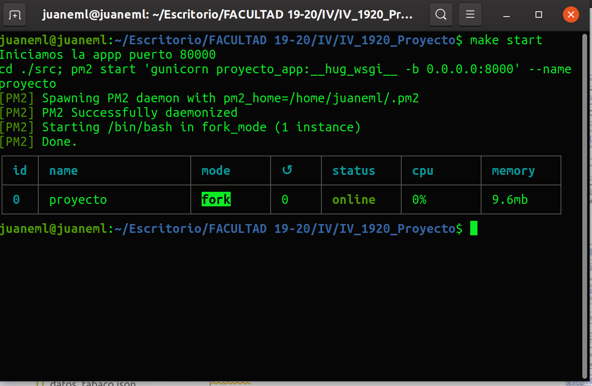

  - Comprobamos que funciona: `curl <url:puerto>`
  ~~~
  curl 0.0.0.0:8000
  ~~~

  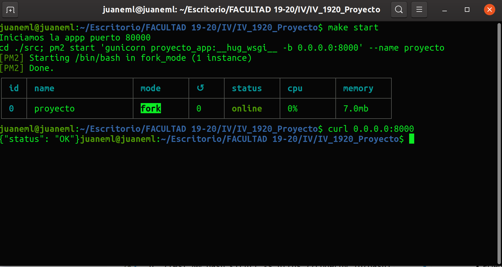
 

  - Comprobamos el estado del servicio: `pm2 status proyecto` 
  ~~~
  make status
  ~~~
  

  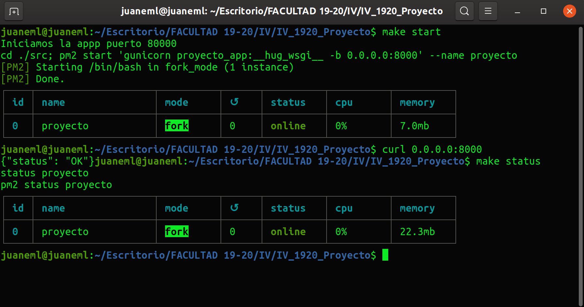
 
   
  - Paramos el servicio: `pm2 stop proyecto`
  
  ~~~
    make stop
  ~~~

  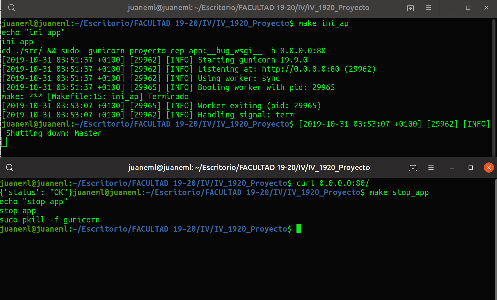  

  - Borramos el servicio: `pm2 delete proyect`
- 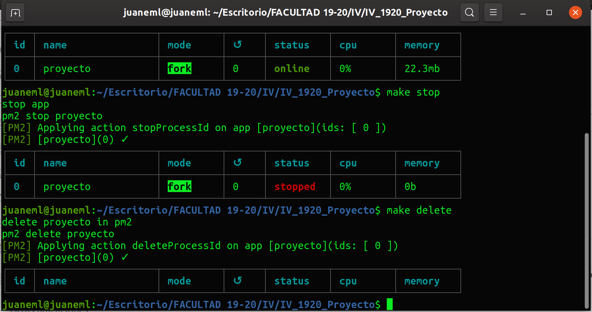
  - logs_repo, nos mostrará los logs del repositorio 
   ~~~
    make logs_repo 
   ~~~

  Puedes visitar la documentación de clases [aquí](https://github.com/juaneml/IV_1920_Proyecto/blob/master/src/README.md)

# PaaS Heroku
# Despliegue de aplicación en [heroku](https://www.heroku.com/)

A continuación veremos los pasos para desplegar nuestra aplicación.

## Paso 1:
- Nos registramos en [Heroku](https://www.heroku.com/)
- Elegimos el nombre de nuestra aplicación, en mi caso proyecto-iv
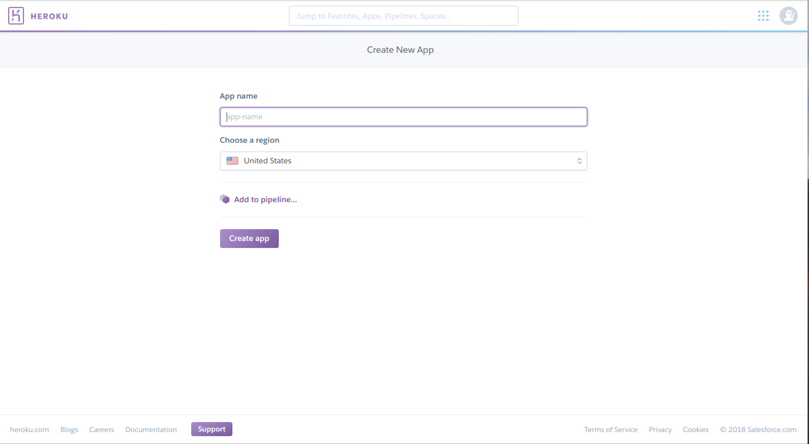

## Paso 2:
- Conectamos nuestra aplicación con nuestro repositorio eh Github
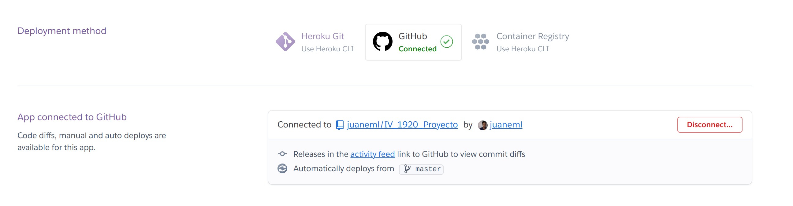

## Paso 3:
- Activamos la opción Wait for CI to pass before deploy, ya que tenemos a Travis para
la ejecución de los tests.
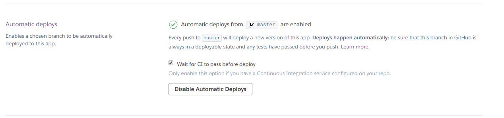

# Adaptamos el proyecto para la ejecución de heroku

- Añadimos los requerimientos en el archivo [requirements.txt](.//../requirements.txt) necesarios en mi caso son los siguientes :
   ~~~~
    Hug==2.6.0
    pytest==5.2.1
    pip==19.2
    PyYAML==5.1.2
    psycopg2==2.8.3
    pipenv
    coverage==4.5.4
    pytest-cov==2.7.1
    python-coveralls==2.9.2
    codecov
    gunicorn==19.5.0
   ~~~~
# Añadimos un nuevo archivo con nombre [Procfile](./../Procfile) con el contenido siguiente:
  ~~~
   web: cd src && gunicorn proyecto-dep-app:__hug_wsgi__ --log-file -
  ~~~

 - Este archivo es necesario para indicarle a Heroku como ejecutar nuestra aplicación, indica que se mueva al directorio donde está la aplicación, directorio src,se indica que el proceso es un proceso web que va a recibir tráfico HTTP y que se ejecute la el fichero Python con nombre proyecto-dep_app,con el servidor web gunicorn ejecute la aplicación de Python que usa como framework hug  con los parámetros __hug_wsgi__ como nos indica la documentación [hug](https://www.hug.rest/website/quickstart) y así integre nuestra aplicación de microservicio.

# Añadimos otro archivo con nombre [runtime.txt](./../runtime.txt) con el contenido siguiente:
~~~~
python-3.7.5 
~~~~
- Que en mi caso especifico la versión de python que uso.

- Por defecto Heroku tiene Python 3.6.6 y como usamos python 3.7.5, consultando la [documentación](https://devcenter.heroku.com/changelog-items/1442), nos indica que podemos especificar la versión de python con un nuevo archivo con nombre runtime.txt por esta razón se ha añadido el archivo.  
 - Así ya tendremos a nuestra aplicación en la plataforma de Heroku.

# PaaS Azure
# Despliegue de aplicación en [azure](https://azure.microsoft.com/es-es/free/search/?&ef_id=Cj0KCQiAiNnuBRD3ARIsAM8KmltdzErNaoJ-qfkq0dVgt7CPXJUWdD_4Ho5HnxzMa3sFBC_hGmw_OLMaAjxSEALw_wcB:G:s&OCID=AID2000115_SEM_VAab2G2A&MarinID=VAab2G2A_325806734845_azure_e_c__68954907492_aud-394034018130:kwd-49508422&lnkd=Google_Azure_Brand&dclid=COiOhNH5--UCFUbIUQodAS4MqQ)

- A continuación veremos los pasos para desplegar nuestra aplicación.

- Lo primero que tenemos que hacer es registrarnos en la plataforma de [azure](https://azure.microsoft.com/es-es/free/search/?&ef_id=Cj0KCQiAiNnuBRD3ARIsAM8KmltdzErNaoJ-qfkq0dVgt7CPXJUWdD_4Ho5HnxzMa3sFBC_hGmw_OLMaAjxSEALw_wcB:G:s&OCID=AID2000115_SEM_VAab2G2A&MarinID=VAab2G2A_325806734845_azure_e_c__68954907492_aud-394034018130:kwd-49508422&lnkd=Google_Azure_Brand&dclid=COiOhNH5--UCFUbIUQodAS4MqQ).

- Una vez que hemos iniciado sesión vamos a crear nuestra aplicación.

## Creación de la aplicación

- Vamos a `+` Crear un recurso, elegimos aplicación web, obtendremos una salida como esta:
  
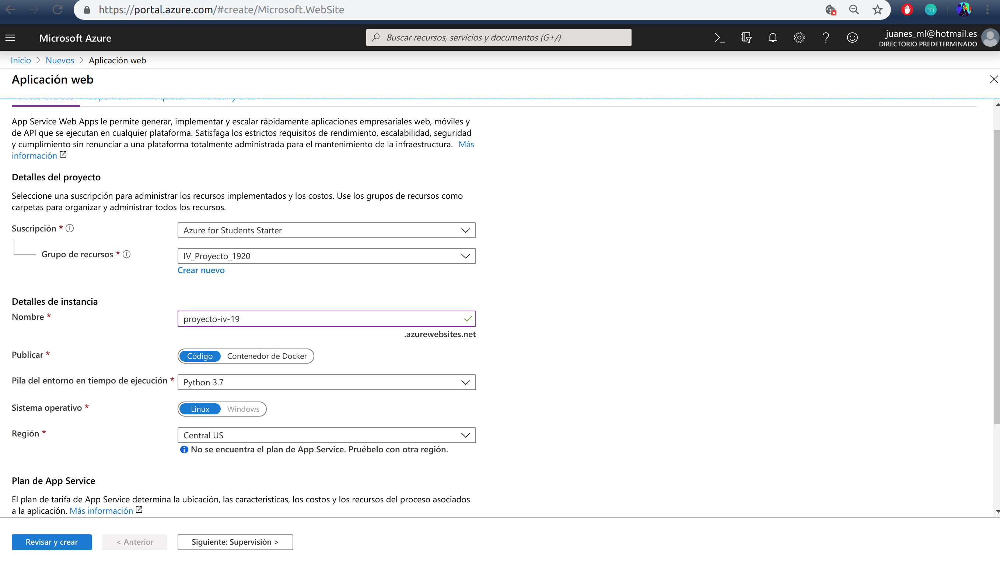

### Supcrición

- Elegimos nuestra subscripción, en mi caso Student Starter, también está creada en la subcripción de la asignatura pero no puedo mostrarla ya que el crédito lo agoté.

- Elegimos un nombre para nuestro grupo de recursos en mi caso `IV_Proyecto_1920`

### Detalles de instancia

- **Nombre**: el nombre de nuestra aplicación, en mi caso proyecto-iv-19
- **Publicar**:Elegimos código.
- **Sistema operativo**: sistema Linux.
- **Región**: la que viene por defecto Central US.
- **Plan de App Service**: El que nos viene con la subscripción.

## Revisar y crear

- Revisamos que la configuración es la deseada y pasamos a crearla.
- Obtendremos una salida como esta:

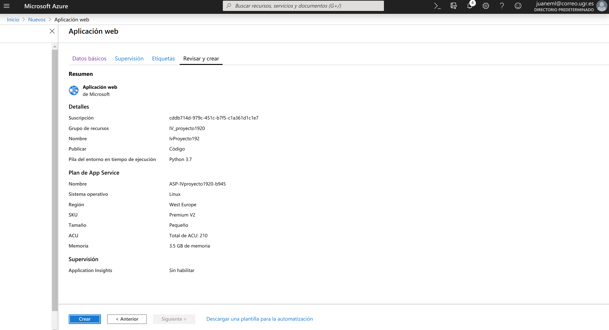

- Una vez finalizada la creación tendremos una salida como esta:

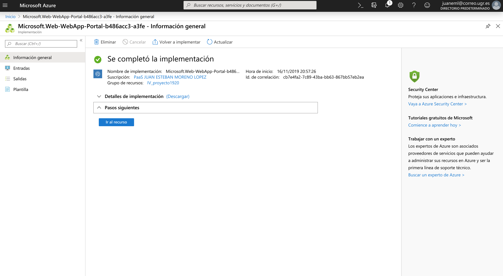

## Implementación de la aplicación

- Vamos a Centro de implementación, tendremos una salida como esta:

- En ella añadimos la implementación continua, en mi caso del repositorio de GitHub para la asignatura, le damos a continuar y elegimos el repositorio, una vez configurado ya tendremos configurada la aplicación con el código de nuestro repositorio de Github, tendremos una salida como esta:

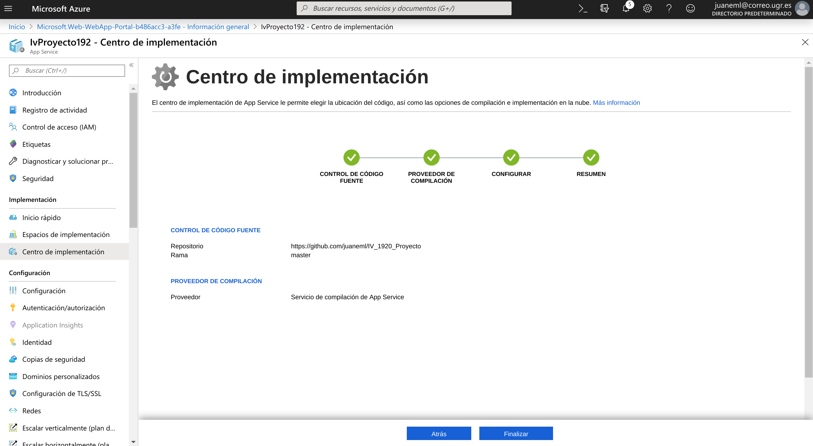

- En configurar nuestros dados:
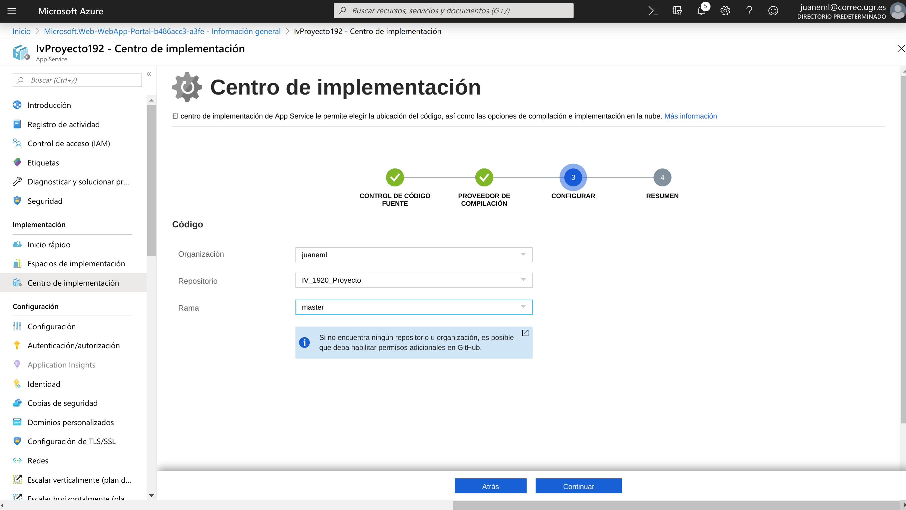
- Para acabar le damos a finalizar y azure comenzará a recopilar la información de nuestro repositorio y a configurar lo necesario para que esté lista nuestra aplicación.

## Configurar

- Para que nuestra aplicación funcione correctamente,necesitamos configurarla para ello vamos a la sección de Configuración/Configuración general y añadimos el comando de inicio que queremos que se ejecute para desplegar nuestra aplicación en mi caso es con gunicorn:

~~~~
cd ./src && gunicorn proyecto_app:__hug_wsgi__ 
~~~~

- Una vez que hemos introducido el comando de inicio, Guardamos la configuración.

## Opción por comandos

- Lo primero que tenemos que hacer es descargarnos el CLI de Azure, consultamos el siguiente [enlace](https://docs.microsoft.com/es-es/cli/azure/install-azure-cli?view=azure-cli-latest)

- Buscamos nuestro sistema operativo, en mi caso Ubuntu, [cli azure ubuntu](https://docs.microsoft.com/es-es/cli/azure/install-azure-cli-apt?view=azure-cli-latest)

### Paso 1

- En un terminal escribimos el siguiente comando:

~~~~
curl -sL https://aka.ms/InstallAzureCLIDeb | sudo bash
~~~~

- Actualizamos e instalamos los certificados

~~~~
sudo apt-get update
sudo apt-get install ca-certificates curl apt-transport-https lsb-release gnupg
~~~~
  
### Paso 2

- Descargamos e instalamos la clave de firma de Microsoft:

~~~~
curl -sL https://packages.microsoft.com/keys/microsoft.asc | 
    gpg --dearmor | 
    sudo tee /etc/apt/trusted.gpg.d/microsoft.asc.gpg > /dev/null
~~~~

- Agregamos el repositorio de software de la CLI de Azure necesario:

~~~~
AZ_REPO=$(lsb_release -cs)
echo "deb [arch=amd64] https://packages.microsoft.com/repos/azure-cli/ $AZ_REPO main" | 
    sudo tee /etc/apt/sources.list.d/azure-cli.list
~~~~

### Paso 3
- Actualizamos la información del repositorio e instalamos el paquete de `azure-cli`
  
~~~~
sudo apt-get update
sudo apt-get install azure-cli
~~~~

## Pasamos a iniciar sesión mediante el comando `az login`

~~~~
az login
~~~~

## Pasamos a la implementación de nuestra aplicación

### Creamos el grupo de recursos
Consultamos,[resource group](https://docs.microsoft.com/es-es/cli/azure/group?view=azure-cli-latest#az-group-create)

az group create --location centralus -n IV_Proyecto_1920

- Comprobamos que exite el grupo de recursos.

~~~~
az group exists -n IV_Proyecto1920
~~~~

- Si todo ha ido bien obrendremos la salida con `true` y tendremos el recurso creado.

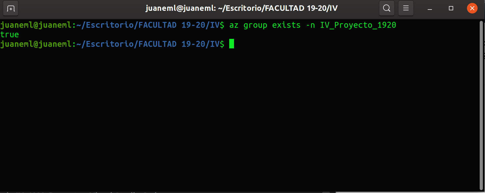

- Para ver las caracteristicas del grupo de recursos usamos:

~~~~
az group show -n IV_Proyecto_1920
~~~~

- Obtendremos una salida como est:
  
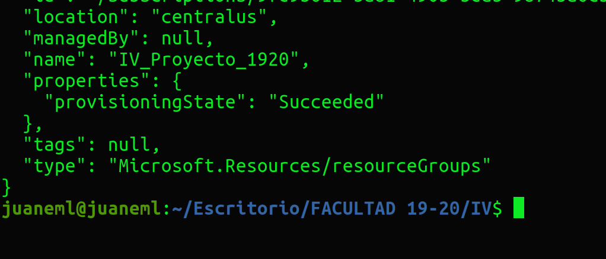

### Pasamos crear un app appservice plan

- Una vez finalizada la creación del grupo de recursos pasamos a la creación del `app service plan` el cual nos permite gestionar los planes de servicio de aplicaciones, consultamos [appservice plan](https://docs.microsoft.com/es-es/cli/azure/appservice/plan?view=azure-cli-latest#az-appservice-plan-create)

Usamos el comando `appservice plan` de la siguiente forma:

~~~~
az appservice plan create -g IV_Proyecto_1920 --is-linux --sku F1 -n FREE 
~~~~

## Procedemos a la creación de la aplicación

Pasamo a la creación de nuestra aplicación, consultamos
[az webapp create](https://docs.microsoft.com/es-es/cli/azure/webapp?view=azure-cli-latest#az-webapp-create)

Y para la configuración de python consultamos[app_python](https://docs.microsoft.com/en-us/cli/azure/webapp?view=azure-cli-latest#az-webapp-list-runtimes)
Creamos una aplicación web con Python 3.7 y desplegamos de nuestro repositorio local de git.

Para saber el runtime necesario  para python y nuestra versión consultamos con el comando
~~~~
az webapp list-runtimes --linux
~~~~
Y veremos todas las disponibles para linux que es el sistema que necesito.

- Obtendremos una salida como esta
- 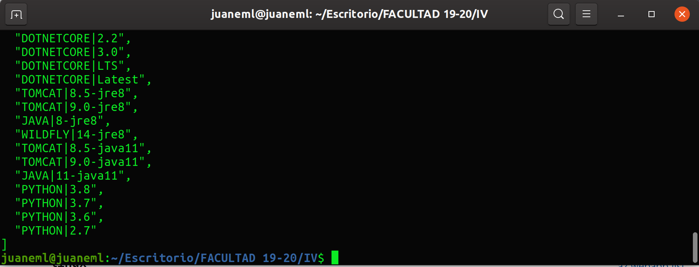

~~~~
az webapp create --resource-group IV_Proyecto_1920 --plan FREE --name proyecto-iv-19  --deployment-source-url https://github.com/juaneml/IV_1920_Proyecto
~~~~

- `--resource-group`, le indicamos el recurso, en mi caso IV_Proyecto_1920.
  
- `plan`, le indicamos el plan que hemos definido en mi caso, FREE.

- `--name`, el nombre de nuestra aplicación,en mi caso proyecto-iv-19.

- `--deployment-source-url`, la url del código que vamos a desplegar en mi caso de Github.

Al finalizar ya tendremos nuestra aplicación.

## Para finalizar

- Vamos a la sección de introducción iniciamos la apliación si no está iniciada y para ver nuestra aplicación desplegado accedemos a URL y obtendremos una salida como esta:

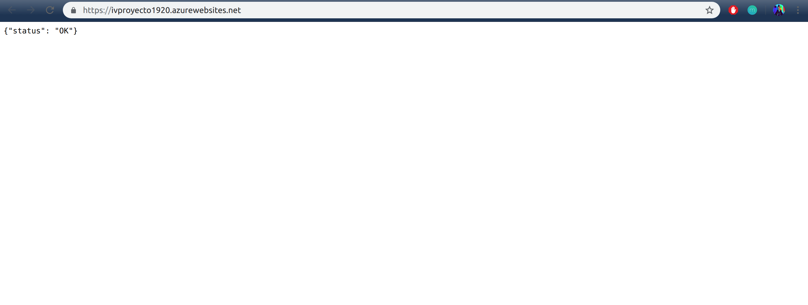

Ya tenemos nuestra aplicación desplegada en la plataforme de azure.

# Docker

# El despliegue en Docker

- Nos dirigimos a create Repository y creamos un repositorio.

- Elegimos el nombre de nuestro contenedor y la descipción, dejamos la visibilidad pública.
  
- Para la configuración de compilación,build settings, nos conectamos a nuestro repositorio de github. Seleccionamos nuestro usuario y el repositorio que queremos usar.

- Para las reglas de compilación dejamos la que nos viene por defecto, latest, y finalmente create and build.

- Necesitamos crear un fichero con nombre Dockerfile en nuestro repositorio de github, para que docker pueda construir nuestro contenedor, tenemos que especificarle la imagen que vamos a usar, así como las dependencias y requisitos necesarios, para la creación del DockerFile hemos visitado la [documentación](https://hub.docker.com/_/python/).

- El [Dockerfile](../Dockerfile) quedaría tal que así:
  
~~~~
FROM python:3.7-alpine

LABEL maintainer="juaneml@correo.ugr.es"

WORKDIR /proyecto_iv-19
COPY . /proyecto_iv-19

RUN apk update \
  && apk add --virtual build-deps gcc python3-dev musl-dev \
  && apk add postgresql-dev \
  && pip install psycopg2 \
  && apk del build-deps
  
RUN pip3 install --no-cache-dir -r requirements.txt

CMD cd src && gunicorn proyecto_app:__hug_wsgi__ -b 0.0.0.0:8000
EXPOSE 8000/tcp

~~~~

- Se usa `FROM python:3.7-alpine`, porque es una imagen que no pesa demasiado unos 98MB y para nuestra aplicación es suficiente ya que cubre todas las necesidades que necesitamos.

- `LABEL` especificamos el propietario o personal de mantenimiento.

- `WORKDIR` indicamos el directorio de trabajo.

- `COPY . /proyecto_iv-19`, con `COPY .` indicamos a docker que queremos copiar todo el contenido del repositorio en la ruta `proyecto_iv-19`.

- `RUN apk update \
  && apk add --virtual build-deps gcc python3-dev musl-dev \
  && apk add postgresql-dev \
  && pip install psycopg2 \
  && apk del build-deps`,
  con este comando actualizamos y añadimos lo necesario para poder instalar psycopg2 que es necesario para postgresql y que posteriormente se hará uso.

- `Run pip3 install --no-cache-dir -r requeriments.txt` con este comando instalamos las dependencias con `--no-cache-dir` desabilitamos la memoria caché, queremos que nuestro docker ocupe lo mínimo posible.
  
- `CMD cd src && gunicorn proyecto_app:__hug_wsgi__ -b 0.0.0.0:8000`, primero nos situamos en el directorio src donde tenemos el código de nuestra aplicación y luego indicamos que con `gunicorn` lancemos nuestra aplicación en el puerto `8000`.

- `EXPOSE 8000/tcp` finalmente con este comando indicamos que se habilite el puerto 8000 para el protocolo tcp.

## Dockerignore

- Creamos otro fichero [.dockerignore](../.dockerignore) para evitar que se copien ficheros innecesarios tales como los test y las configuraciones para travis y heroku, este fichero es el siguiente:

~~~~
*git
*doc
*test*
*.yml
*circleci*
*github*
*pytest_cache*

Procfile
~~~~

# Imagen de docker
[Docker](https://hub.docker.com/r/juaneml/proyecto-iv-19)

# Desplegamos el contenedor en Heroku

- Para hacer el despliegue hacemos uso de la [documentación](https://devcenter.heroku.com/articles/build-docker-images-heroku-yml) disponible en heroku.

- Necesitamos crear el fichero heroku.yml, este nos permite decirle a Heroku que vamos a crear una imagen a partir del fichero DockerFile.

- Especificamos la imagen de Docker para compilar el proceso web de la aplicación, tanto [heroku.yml](../heroku.yml) como [Dockerfile](../Dockerfile) están en el mismo directorio. Si no se incluye run, Heroku usa el CMD especificado en el Dockerfile.

- Heroku.yml

~~~~
build:
  docker:
    web: Dockerfile
run:
  web: cd src && gunicorn proyecto_app:__hug_wsgi__ --log-file -
~~~~

- Una vez añadido el fichero herokuyml, ejecutamos la orden:

~~~~
heroku stack:set container -a proyecto-iv-19-docker
~~~~

- Indicamos a heroku que es un contenedor y el nombre de la aplicación proyecto-iv-19-docker.

- Por último, actualizamos ejecutando el comando 
~~~~
git push heroku master
~~~~

# Contenedor heroku

[Heroku docker](https://proyecto-iv-19-docker.herokuapp.com/)

salida:
~~~~
{"status": "OK"}
~~~~

# Despliegue en Azure con Docker

- Dentro del portal de Azure, vamos a `Crear un recurso`, Aplicación web, elegimos el grupo de recursos si ya lo teniamos creado o creamos uno, elegimos el nombre de nuestra aplicación, en mi caso `docker-proyecto-iv-19`, en la opción de publicar elegimos la opción de `contenedor de Docker`.

- Luego vamos a la pestaña Docker, elegimos `Contenedor único` en opciones, Origen de imagen `Docker Hub`, el tipo de acceso público ya que es público en docker, y en imagen y etiqueta elegimos la imagen, en mi caso `juaneml/proyecto-iv-19`.

- Vamos a revisar y crear.
- Confirmamos con next.

- Cuando finalice obtendremos esta salida:

Vamos al recurso que hemos creado y ya tendremos nuestra aplicación con docker en azure.

### salida

## Docker azure
[Docker azure](https://docker-proyecto-iv-19.azurewebsites.net/)

# Provisionamiento
- Para el provisionamiento vamos hacer uso de vagrant, para poder hacer uso de vagrant tenemos que tener instalado [Virtualbox](https://www.virtualbox.org/) un programa que nos permitirá virtualizar nuestra máquina.
  
# Creación del Vagrantfile

- Para ello necesitamos crear un archivo con nombre `Vagrantfile` en el que añadiremos la configuración necesaria para la creación de nuestra máquina.

- Mi [Vagrantfile](../Vagrantfile)

~~~~
    Vagrant.configure('2') do |config|
    config.vm.box = "bento/ubuntu-19.10"

        # Evitar que busque actualizaciones
        config.vm.box_check_update = false

        # configuramos la red de nuestra máquina
        config.vm.network "forwarded_port", guest: 8000, host: 8000

    
    # Configuración  para provisionar con ansible
        config.vm.provision "ansible" do |ansible|
            ansible.compatibility_mode = "2.0"
            ansible.version = "2.8.3"
            ansible.playbook = "provision/playbook.yml"
        end
    end
~~~~

- Pasamos a explicar nuestro `Vagrantfile`:
  
- `Vagrant.configure('2') do |config|` indicamos la versión de configuración de Vagrant, en nuestro caso `2`para que sea compatible con anteriores y con las siguientes.
  
- `config.vm.box = "bento/ubuntu-19.10"`, configuramos el sistema operativo en mi caso `ubuntu-19.10` creada con [Bento](https://app.vagrantup.com/bento/boxes/ubuntu-19.10) por [Chef](https://supermarket.chef.io/), se ha elegido este sistema operativo porque es el que se utiliza en la máquina de trabajo y como es el ubuntu más reciente facilmente se pueden arreglar errores que puedan surgir en el futuro.
  
- Para que en nuestra máquina funcione la conexión con nuestra aplicación y podamos lanzarla, tenemos que configurar la red de nuestra máquina, para ello hacemos uso del siguiente comando: `config.vm.network "forwarded_port", guest: 8000, host: 8000` donde indicamos que el puerto donde escucha es el 8000, puerto que usa nuestro framework [Hug](https://www.hug.rest/website/quickstart).
- Visitada la documentación de vagrantup, [networking](https://www.vagrantup.com/docs/networking/basic_usage.html)

- Por último y no menos importante indicamos el mecanismo de provisionamiento que vamos a utilizar, en mi caso hago uso de [Ansible](https://docs.ansible.com/ansible/latest/user_guide/playbooks.html?extIdCarryOver=true&sc_cid=701f2000001OH7YAAW).
- Con `config.vm.provision "ansible" do |ansible|` indicamos que vamos a provisionar con ansible.
- Para evitar `warnings` en la ejecución de ansible añadimos la siguiente configuración:
- `ansible.compatibility_mode = "2.0"`, donde indicamos que use ansible en modo de compatibilidad.
- `ansible.version = "2.8.3"`, donde indicamos que use la versión actual `2.8.3`, versión que tengo instalada en mi máquina de trabajo.
  
- Levantamos la máquina haciendo uso del siguiente comando:

~~~
vagrant up
~~~

- Salida:
  
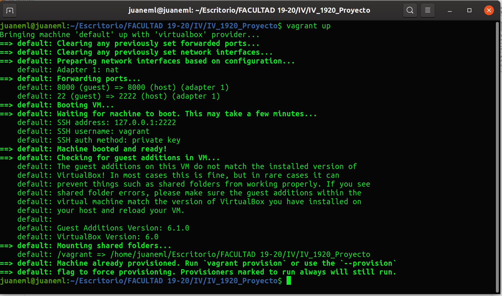

- Provisionamos nuestra máquina con el siguiente comando:
  
~~~~
vagrant provision
~~~~  

- Salida:
  
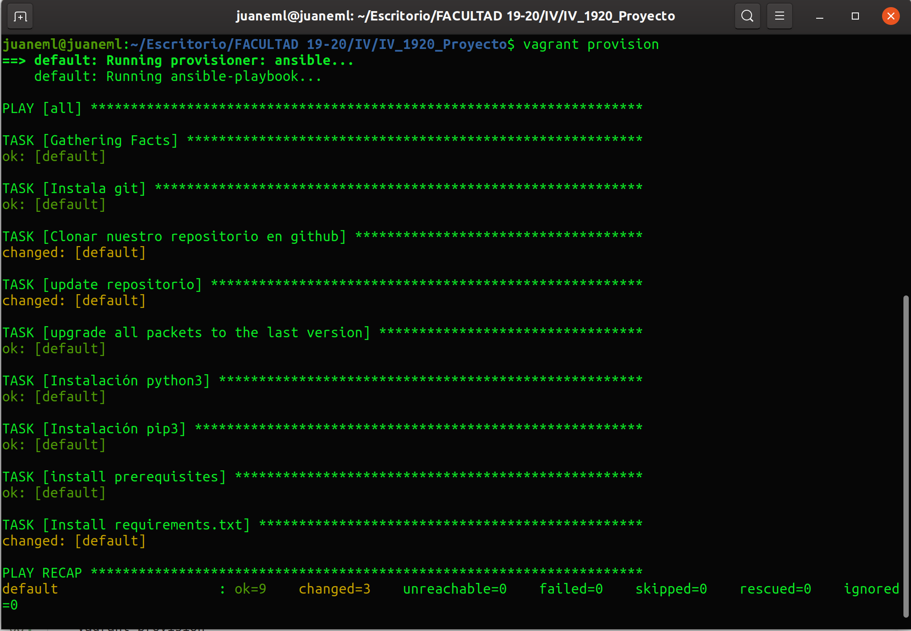

- Apagamos la máquina con el siguiente comando:
  
~~~~
vagrant halt
~~~~

- Salida:
  
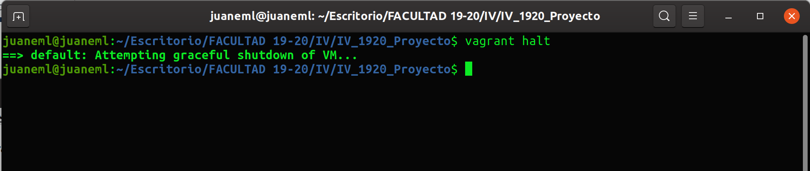
# Provisionamiento con Ansible

- Como comentaba antes, para aportar el provisionamiento a la máquina virtual hago uso de ansible.

- Ansible lo que nos permite una vez creada la máquina virtual es provisionar de utilidades que necesita nuestra máquina, de forma que automaticemos el aprovisionamiento, tales como instalaciones de paquetes como pip3, git, la clonación de nuestro repositorio y la instación de los requirements necesarios definidos en nuestro repositorio y que nuestra máquina necesita para lanzar nuestro microservicio.

- El archivo necesario tiene extensión .yml y como nombre [playbook.yml](../provision/playbook.yml).

- Mi playbook.yml tiene el siguiente contenido:

~~~~
---
    - hosts: all
      become: yes
      tasks:
    
        # Instalacion de git
        - name: Instala git
          apt: pkg=git force_apt_get=yes  state=present 
    
        # Clonamos Repositorio
    
        - name: Clonar nuestro repositorio en github
          git:
            repo: https://github.com/juaneml/IV_1920_Proyecto.git
            dest: proyectoiv19/
          become: no
    
        #Actualizamos repositorios
    
        - name: update repositorio
          apt:
            update_cache: yes 
          become: yes 
    
        #upgrade repositorios
        - name: upgrade all packets to the last version
          apt:
            upgrade: dist
          become: yes
        #Instalamos python3
    
        - name: Instalación python3
          apt: pkg=python3.7 state=present
          become: yes
    
      # Instalamos pip3
    
        - name: Instalación pip3
          apt: pkg=python3-pip state=latest
    
          become: yes

      # instalamos requisitos necesarios para psycopg2

        - name: install prerequisites
          apt: 
          
            pkg: ['libpq-dev', 'python3-psycopg2']
          
          become: yes

      # Instalamos Requirements necesarios para nuestro microservicio
    
        - name: Install requirements.txt
          command: pip3 install -r proyectoiv19/requirements.txt 
          
          become: yes

~~~~

- Para comprobar que hemos escrito bien el playbook.yml, ejecutamos el siguiente comando:
  
~~~~
  ansible-playbook provision/playbook.yml --syntax-check
~~~~

- Si queremos volver a provisionar una vez creada nuestra máquina, podemos hacerlo mediante el comando:

~~~~
 ansible-playbook provision/playbook.yml --syntax-check
~~~~

- Comentamos la configuración de nuestro archivo playbook.yml
  
- Indicamos  con `host: all` que es para todas las máquinas
- Con `task` indicamos las tareas que va a ejecutar ansible.
- Etiqueta `name` indicamos el nombre de la tarea.
  
- `name: Instala git
          apt: pkg=git force_apt_get=yes  state=present ` indicamos que instale git.

-  `name: Clonar nuestro repositorio en github
          git:
            repo: https://github.com/juaneml/IV_1920_Proyecto.git dest: proyectoiv19 become: no` 
    indicamos que clone nuestro repositorio de github y con become sin privilegios.

-  `name: update repositorio
          apt:
            update_cache: yes 
          become: yes `
actualizamos repositorio.

- `name: upgrade all packets to the last version
          apt:
            upgrade: dist
          become: yes` 
actualizamos todos los paquetes a la última versión.

- `- name: Instalación python3
          apt: pkg=python3.7 state=present
          become: yes` instalamos python3 versión 3.7.

- ` name: install prerequisites
          apt: 
            pkg: ['libpq-dev', 'python3-psycopg2']
          become: yes`
instalamos requisitos necesarios para instalar psycopg2 necesario para el posterior uso de postgresql.

- Por último, Instalamos Requirements necesarios para nuestro microservicio `
          name: Install requirements.txt
          command: pip3 install -r proyectoiv19/requirements.txt` 

# Vagrant Cloud

Después de haber creado nuestra máquina, vamos a subirla a [Vagrant Cloud](https://www.vagrantup.com/).
- Para ello nos creamos una cuenta, una vez creada pasamos a crear nuestra `box`.

- Hacemos uso del comando:

~~~~
vagrant package --output sinHumo.box
~~~~

- Mi box le ha llamado sinHumo.box, la salida es la siguiente:

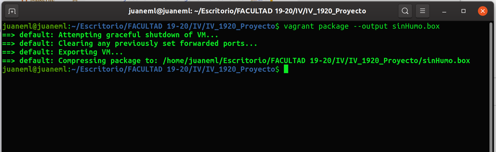

- Pasamos a subir nuestro paquete, `sinHumo` para ello nos vamos a la página y nos dirigimos a  `new vagrant box`, obtendremos una salida como esta:

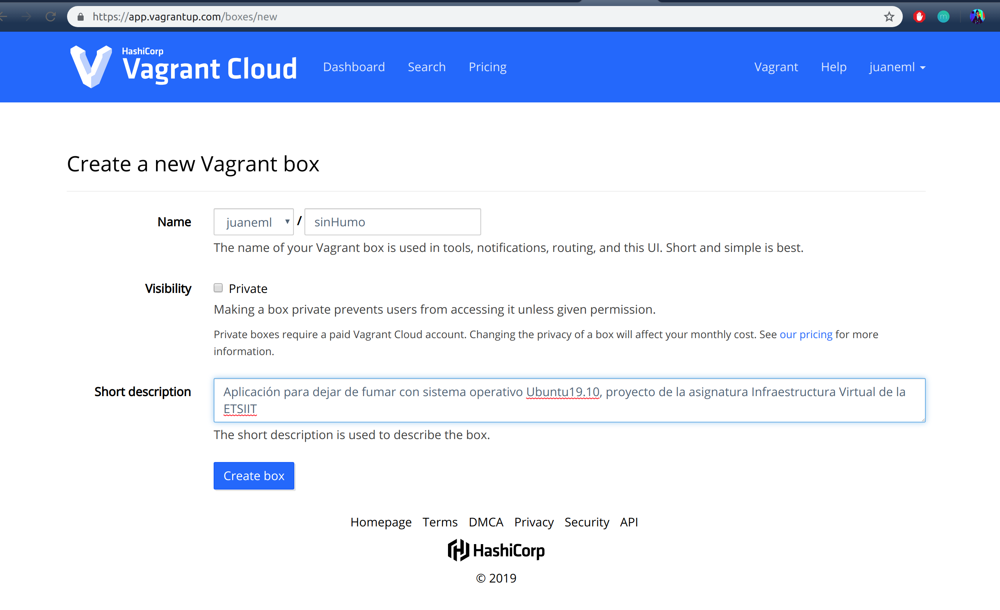.

- Indicamos el nombre de nuestro paquete y una breve descripción, para indicar que incluye nuestro paquete.

- El siguiente paso, indicamos la versión en mi caso `1`, obtendremos una salida como esta:

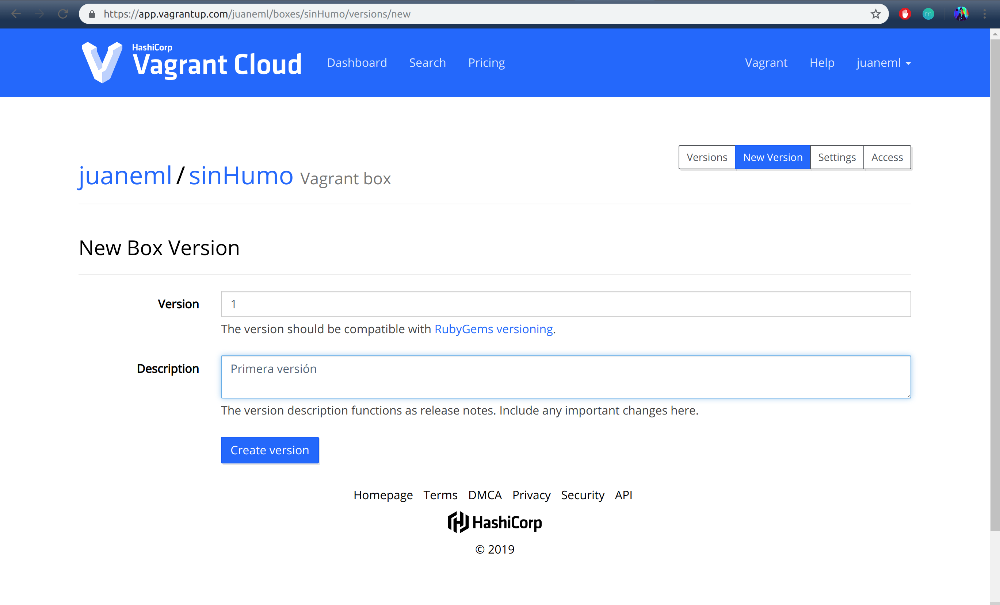

- Creamos la versión y al crear la versión obtendremos una salida como esta.
  
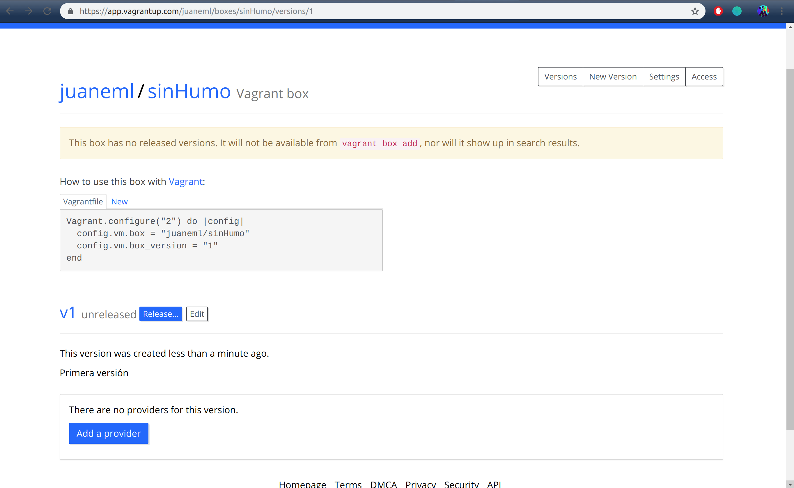

- Subimos el archivo y al finalizar la subida ya tendremos nuestro vagrant box subido.

- Puedes consultar mi vagrant box en la siguiente url:
  
Url box https://app.vagrantup.com/juaneml/boxes/sinHumo 
### Referencias

- [Vagrant networking](https://www.vagrantup.com/docs/networking/basic_usage.html)
  
- [Vagrant package](https://www.vagrantup.com/docs/cli/package.html)
  
- [Ansible Provider](https://www.vagrantup.com/docs/provisioning/ansible.html)

- Puedes consultar la documentación en:
  
[Doc](https://juaneml.github.io/doc_IV-1920_Proyecto/).
