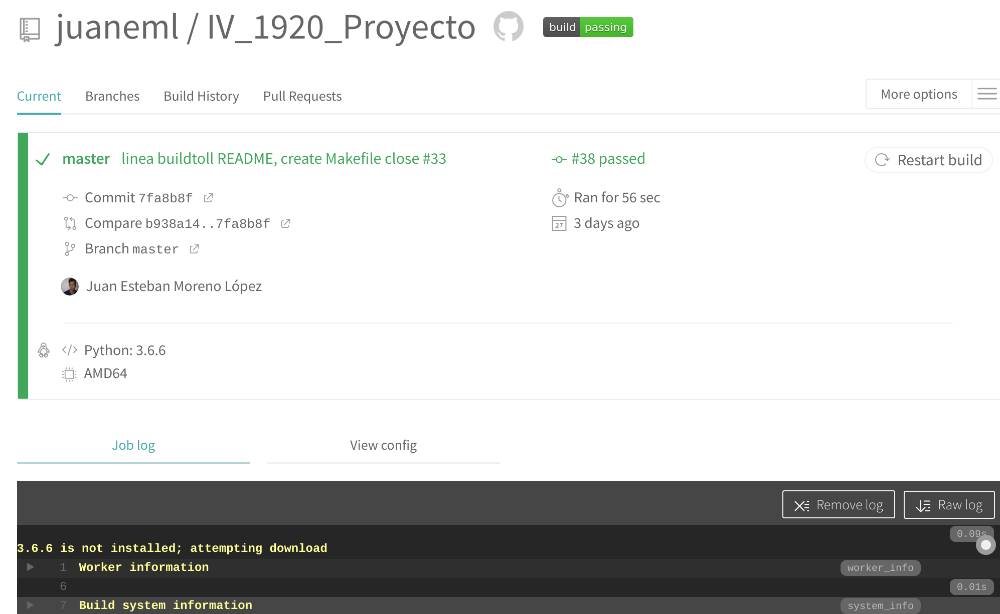
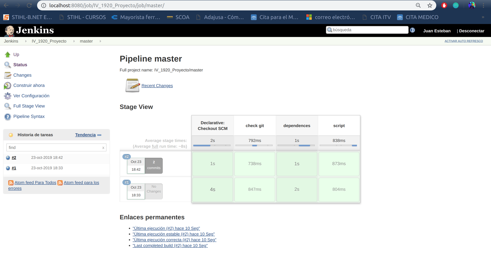
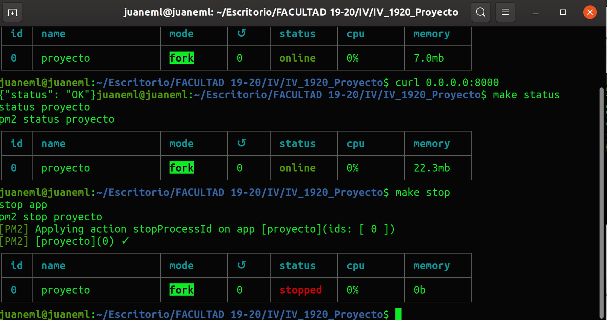

# Documentación

## Herramientas a usar

### Lenguaje

- El lenguaje que se va a usar es [Python](https://www.python.org/) un lenguaje que tiene tipado dinámico, esto quiere decir que el tipo de dato dependerá de la asignación de la variable, personalmente me gusta, es familiar ya que lo he cursado en otras asignaturas y también existe mucha documentación que facilita el aprendizaje y la resolución de errores.
  
### Framework
- El framework que voy a usar es [hug](http://www.hug.rest/) lo vi el curso pasado y me resultó simple de usar por los pocos pasos que hay que seguir para que funcione como son las configuraciones, instalación y uso. Además en la documentación viene con ejemplos fácil de seguir y para el desarrollo con Python me parece muy adecuado para mi proyecto.
  
### Gestor de base de datos
- Para la base de datos voy a utilizar [Postgresql](https://www.postgresql.org/) me parece muy adecuado ya que existe bastante documentación y quiero aprender a usar una base relacional de código abierto. También documentándome por la web vi que para un alto volumen de datos el rendimiento con otras bases de datos es mayor, por lo que para un futura continuación del proyecto me parece muy atractivo.  

### Logs
- Para el login de los usuarios y los logs haré uso de la biblioteca de python [loggin](https://docs.python.org/3/library/logging.html) que permitirá el correcto registro de mensajes para el microservicio.
  
### Test

- Para comprobar el correcto funcionamiento se hará uso de test, para ello se usará [Pytest](https://docs.pytest.org/en/latest/) Además haremos uso del servicio de integración continua [Travis](https://travis-ci.org/) que se configurará para este repositorio. Es una herramienta fundamental para comprobar que el desarrollo de nuestro servicio, ya que nos permite integrar fácilmente con Github ejecutando el pipeline definido en cada push o pull request. Nos permitirá testear por completo nuestra aplicación para después en el despliegue no tener ninguna sorpresa.

- Adicionalmente para hacer más clara y tener mejor organizada la documentación se ha hecho un [repositorio](https://github.com/juaneml/doc_IV-1920_Proyecto) para hacer uso de [hg-pages](https://pages.github.com/).

## [Travis](https://travis-ci.org/) 

- Servicio que proporciona la integración continua.
  - Este servicio permite ejecutar tests de nuestro repositorio en Github.
  - Los pasos son muy sencillos y son:
    - Nos registramos con nuestra cuenta de Github.
    - Creamos en el repositorio donde queremos tener la integración continua un archivo con el nombre [.travis.yml](https://github.com/juaneml/IV_1920_Proyecto/blob/master/.travis.yml),

    Fichero .travis.yml
    ~~~
    language: python

        python:
        - "3.7"

        # command to install dependencies
        install:
        - pip3 install -r requirements.txt
        - pip3 install codecov
        - pip3 install pytest-cov
        - pip3 install python-coveralls
        - pip3 install coveralls
        services:
        - postgresql
            
        before_script:
        - psql -c 'create database travis_ci_test;' -U postgres
        
        
        # command to run tests
        script: 
        - cd ./test && pytest -v test.py 
        - coverage run test.py
        - coverage report -m
        - coverage xml

        after_success:
        - bash <(curl -s https://codecov.io/bash) -t d0ba6a02-f9f7-44ab-b128-a82396d54280 -f coverage.xml

    ~~~     
     
  - Vamos a describir este archivo:
    - language: lenguage de programación usado, en mi caso [python](https://www.python.org/), versión 3.7. 
    - Los comandos para instalar las depencecias:
      - con pip3 install instalamos:
        - [requirements.txt](https://github.com/juaneml/IV_1920_Proyecto/blob/master/requirements.txt),requisitos que necesitamos.
        - [codecov](https://codecov.io/), una herramienta de integración para comparar la cobertura de nuestro código.
        - [coverage](https://coverage.readthedocs.io/en/v4.5.x/), para medir la cobertura de los programas programados en python, nos permitirá ver el seguimiento del uso de las distintas funciones, es decir el uso en la aplicación de los distintos test.
        - [coveralls](https://coveralls.io/), otra herramienta para la cobertura de nuestro código, que posteriormente se hará uso.
        - y por último incluimos la instrucción de pytest para la ejecución de test de nuestro proyecto.
        - Se activa el servicio de postgreSql que posteriormente se hará uso.
        - Con ***psql -c***  , se crea una base de datos.
        - pytest para el uso de test.
        - coverage run nombre del test, para aplicar la cobertura a nuestro test.
        - coverage report -m, que nos mostrará la cobertura de nuestro código
        - coverage xml, para crear nuestro reporte.
        - bash <(curl -s https://codecov.io/bash) -t codec_token -f nombre_archivo.xml para subir nuestro reporte y poder seguirlo en la la web de [codecov](https://codecov.io/).
        
    - Una vez configurado nuestro archivo .travis.yml vamos a la web de travis.   
    - En el panel de Travis activamos nuestro proyecto
     
    
    - En la pestaña Dashboard podremos ver nuestro repositorio activo.
    - Para poder verlo con más detalle lo seleccionamos y veremos si ha ido todo bien o hemos tenido algún error.
    - Si todo ha ido bien tendremos una salida como esta:
  
   

## [Jenkins](https://jenkins.io/)

- Opcionalmente se ha instalado otro sistema de integración continua.
  
- Para poder hacer uso del servicio de Jenkins vamos a la página de [Jenkins](https://jenkins.io/)
- Abrimos un terminal y ejecutamos las siguientes instrucciones: 
***
    wget -q -O - https://pkg.jenkins.io/debian/jenkins.io.key | sudo apt-key add -

    sudo sh -c 'echo deb https://pkg.jenkins.io/debian-stable binary/ > /etc/apt/sources.list.d/jenkins.list'

    sudo apt-get update

    sudo apt-get install jenkins

***
- Para más información puedes consultar la documentación facilitada pof [Jenkis doc](https://jenkins.io/doc/book/installing/) 
  
- Una vez instalado vamos a nuestro navegador y escribimos: 
***
    localhost:8080
***

- Obtendremos una salida parecida a esta:

- Vamos a un terminal y ejecutamos:
***
    cat /var/lib/jenkins/secrets/initialAdminPassword

Para obtener la contraseña inicical que nos viene por defecto en Jenkins.
***

- Hacemos la instancia de la configuración.

- Lo dejamos como viene.
- Creamos  un usuario:
- 

- Al finalizar obtendremos la siguiente salida.

- Creamos una tarea con el nombre que deseamos en mi caso multibranck Pipeline.

- En Branck Sources añadimos nuetro respositorio con las credenciales.
- Build Configuration Jenkinsfile.
- Si deseamos que se ejecute cada cierto tiempo tenemos la opcion, Scan Multibranck Pipeline Triggers con el intervalo de tiempo. Finalizada la configuración guardamos.
- Vamos a nuestro repositorio de Github y creamos un archivo con el nombre [JenkinsFile](https://github.com/juaneml/IV_1920_Proyecto/blob/master/Jenkinsfile) con los test que queremos que realice.
  
- Construimos la tarea y una vez finalizada obtendremos una salida como esta:

- Donde podemos ver los resultados.
- También tenemos la opción de ver los logs con los resultados de nuestros test a la tarea.

# Herramienta de construcción
- Hemos definido una herramienta de construcción
[Makefile](https://github.com/juaneml/IV_1920_Proyecto/blob/master/Makefile)

con las siguientes características:

- dependences:
  - instalará las dependencias necesarias como las que tenemos en requirements.txt
  - script:
    - Lanzará los test y cobertura del código así como un reporte en xml.
  - ini_ap: inicia con la herramienta gunicorn la aplicación, una herramienta que nos permite desplegar de forma local nuestra aplicación, aquí tenemos un ejemplo con la ini_ap y el comando curl:
  ~~~
    make ini_ap
    curl 0.0.0.0:80/
  ~~~
 
  
  - stop_ap: para la aplicación.
   ~~~
    make stop_ap
    
   ~~~

  

- logs_repo, nos mostrará los logs del repositorio 
   ~~~
    make logs_repo 
   ~~~

 # Comprobamos que todo ha ido bien:
  Puedes visitar el resultado [aquí](https://github.com/juaneml/IV_1920_Proyecto/blob/master/src/README.md)

- Puedes consultar la documentación en:
  
[Doc](https://juaneml.github.io/doc_IV-1920_Proyecto/).