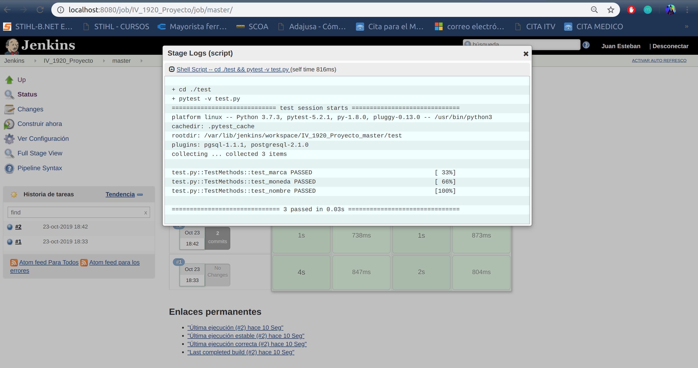

# Documentación

## Herramientas a usar

### Lenguaje

- El lenguaje que se va a usar es [Python](https://www.python.org/) un lenguaje que tiene tipado dinámico, esto quiere decir que el tipo de dato dependerá de la asignación de la variable, personalmente me gusta, es familiar ya que lo he cursado en otras asignaturas y también existe mucha documentación que facilita el aprendizaje y la resolución de errores.
  
### Framework
- El framework que voy a usar es [hug](http://www.hug.rest/) lo vi el curso pasado y me resultó simple de usar por los pocos pasos que hay que seguir para que funcione como son las configuraciones, instalación y uso. Además en la documentación viene con ejemplos fácil de seguir y para el desarrollo con Python me parece muy adecuado para mi proyecto.
  
### Gestor de base de datos
- Para la base de datos voy a utilizar [Postgresql](https://www.postgresql.org/) me parece muy adecuado ya que existe bastante documentación y quiero aprender a usar una base relacional de código abierto. También documentándome por la web vi que para un alto volumen de datos el rendimiento con otras bases de datos es mayor, por lo que para un futura continuación del proyecto me parece muy atractivo.  

### Logs
- Para el login de los usuarios y los logs haré uso de la biblioteca de python [loggin](https://docs.python.org/3/library/logging.html) que permitirá el correcto registro de mensajes para el microservicio.
  
### Test

- Para comprobar el correcto funcionamiento se hará uso de test, para ello se usará [Pytest](https://docs.pytest.org/en/latest/) Además haremos uso del servicio de integración continua [Travis](https://travis-ci.org/) que se configurará para este repositorio. Es una herramienta fundamental para comprobar que el desarrollo de nuestro servicio, ya que nos permite integrar fácilmente con Github ejecutando el pipeline definido en cada push o pull request. Nos permitirá testear por completo nuestra aplicación para después en el despliegue no tener ninguna sorpresa.

- Adicionalmente para hacer más clara y tener mejor organizada la documentación se ha hecho un [repositorio](https://github.com/juaneml/doc_IV-1920_Proyecto) para hacer uso de [hg-pages](https://pages.github.com/).

## [Travis](https://travis-ci.org/) 

- Servicio que proporciona la integración continua.
  - Este servicio permite ejecutar tests de nuestro repositorio en Github.
  - Los pasos son muy sencillos y son:
    - Nos registramos con nuestra cuenta de Github.
    - Creamos en el repositorio donde queremos tener la integración continua un archivo con el nombre [.travis.yml](https://github.com/juaneml/IV_1920_Proyecto/blob/master/.travis.yml), en este archivo ponemos el lenguaje de programación que usamos los requisitos que necesitamos o bien creamos un archivo [requirements.txt](https://github.com/juaneml/IV_1920_Proyecto/blob/master/requirements.txt) donde especificamos los servicios y dependecias que necesitamos y por último incluimos la instrucción de pytest para la ejecución de test de nuestro proyecto.
    - En el panel de Travis activamos nuestro proyecto
    
    - En la pestaña Dashboard podremos ver nuestro repositorio activo.
    - Para poder verlo con más detalle lo seleccionamos y veremos si ha ido todo bien o hemos tenido algún error.

## [Jenkins](https://jenkins.io/)

- Opcionalmente se ha instalado otro sistema de integración continua.
  
- Para poder hacer uso del servicio de Jenkins vamos a la página de [Jenkins](https://jenkins.io/)
- Abrimos un terminal y ejecutamos las siguientes instrucciones: 
***
    wget -q -O - https://pkg.jenkins.io/debian/jenkins.io.key | sudo apt-key add -

    sudo sh -c 'echo deb https://pkg.jenkins.io/debian-stable binary/ > /etc/apt/sources.list.d/jenkins.list'

    sudo apt-get update

    sudo apt-get install jenkins

***
- Para más información puedes consultar la documentación facilitada pof [Jenkis doc](https://jenkins.io/doc/book/installing/) 
  
- Una vez instalado vamos a nuestro navegador y escribimos: 
***
    localhost:8080
***

- Obtendremos una salida parecida a esta:

- Vamos a un terminal y ejecutamos:
***
    cat /var/lib/jenkins/secrets/initialAdminPassword

Para obtener la contraseña inicical que nos viene por defecto en Jenkins.
***

- Hacemos la instancia de la configuración.

- Lo dejamos como viene.
- Creamos  un usuario:
- 

- Al finalizar obtendremos la siguiente salida.

- Creamos una tarea con el nombre que deseamos en mi caso multibranck Pipeline.

- En Branck Sources añadimos nuetro respositorio con las credenciales.
- Build Configuration Jenkinsfile.
- Si deseamos que se ejecute cada cierto tiempo tenemos la opcion, Scan Multibranck Pipeline Triggers con el intervalo de tiempo. Finalizada la configuración guardamos.
- Vamos a nuestro repositorio de Github y creamos un archivo con el nombre [JenkinsFile](https://github.com/juaneml/IV_1920_Proyecto/blob/master/Jenkinsfile) con los test que queremos que realice.
  
- Construimos la tarea y una vez finalizada obtendremos una salida como esta:

- Donde podemos ver los resultados.
- También tenemos la opción de ver los logs con los resultados de nuestros test a la tarea.

# Despliegue de aplicación en heroku

A continuación veremos los pasos para desplegar nuestra aplicación.

## Paso 1:
- Nos registramos en [Heroku](https://www.heroku.com/)
- Elegimos el nombre de nuestra aplicación, en mi caso proyecto-iv

## Paso 2:
- Conectamos nuestra aplicación con nuestro repositorio eh Github

## Paso 3:
- Activamos la opción Wait for CI to pass before deploy, ya que tenemos a Travis para
la ejecución de los tests.

# Adaptamos el proyecto para la ejecución de heroku

- Añadimos los requerimientos en el archivo requirements.txt necesarios en mi caso son los siguientes :
   ~~~
    Hug==2.4.1
    pytest==3.9.3
    PyYAML==5.1.2
    gunicorn
   ~~~
# Añadimos un nuevo archivo con nombre Procfile con el contenido siguiente:
  ~~~
   web: cd src && gunicorn proyecto-dep-app:__hug_wsgi__ --log-file -
  ~~~

 - Este archivo es necesario para indicarle a Heroku como ejecutar nuestra aplicación, indica que se mueva al directorio donde está la aplicación, directorio src,se indica que el proceso es un proceso web que va a recibir tráfico HTTP y que se ejecute la el fichero Python con nombre proyecto-dep_app,con el servidor web gunicorn ejecute la aplicación de Python que usa como framework hug  con los parámetros __hug_wsgi__ como nos indica la documentación [hug](https://www.hug.rest/website/quickstart) y así integre nuestra aplicación de microservicio.

 - Así ya tendremos a nuestra aplicación en la nube:

 Para acceder a la aplicación podemos hacerlo mediante el enlace: [https://proyecto-iv-19.herokuapp.com/](https://proyecto-iv-19.herokuapp.com/)

 # Comprobamos que todo ha ido bien:
  - En la ruta / de nuestra aplicación abrimos el terminal y hacemos uso del comando curl y accedemos a la url que nos proporciona Heroku de    nuestra aplicación.
   ~~~
   $curl https://proyecto-iv-19.herokuapp.com/
   {"status": "OK"}
   ~~~
   - Se ha añadido /lista_usuarios y con el comando curl obtenemos los siguientes resultados.
  ~~~
  "[{'name': 'Usuario 1', 'password': 'asdfj2323as', 'progres': '1995-11-06T23:20:50', 'marca': 'MarcaA', 'tipo': 'Industrial', 'n_cigar': 22}, {'name': 'Usuario 2', 'password': '#@45asfull', 'progres': '2019-04-05T10:15:26', 'marca': 'MarcaE', 'tipo': 'Liar', 'n_cigar': 10}, {'Nombre': 'Usuario 1', 'Password': 'asdfj2323as', 'Num. cigarillos': 22, 'Marca': 'MarcaA', 'Progreso': [8756, 'días', '114.30', 'minutos y', 6858, 'seg.']}, {'Nombre': 'Usuario 2', 'Password': '#@45asfull', 'Num. cigarillos': 10, 'Marca': 'MarcaE', 'Progreso': [205, 'días', '899.70', 'minutos y', 53982, 'seg.']}]"
  ~~~
  - Se ha añadido /datos_calculados y con el comando curl obtenemos los siguientes resultados.
   ~~~
     [{"name": "MarcaA", "tipo": "Industrial", "capacidad": 20, "precio": 4.5, "moneda": "€"}, {"name": "MarcaB", "tipo": "Industrial", "capacidad": 20, "precio": 4.8, "moneda": "€"}, {"name": "Marcac", "tipo": "Industrial", "capacidad": 20, "precio": 5.0, "moneda": "€"}, {"name": "MarcaD", "tipo": "Liar", "capacidad": 30, "precio": 3.5, "moneda": "€"}, {"name": "MarcaE", "tipo": "Liar", "capacidad": 30, "precio": 3.75, "moneda": "€"}, {"Nombre": "Usuario 1", "Progreso": [8756, "días", "114.30", "minutos y", 6858, "seg."], "Dinero Ahorrado": "43342.200000000004€"}, {"Nombre": "Usuario 2", "Progreso": [205, "días", "899.70", "minutos y", 53982, "seg."], "Dinero Ahorrado": "256.25€"}]
  ~~~

- Puedes consultar la documentación en:
  
[Doc](https://juaneml.github.io/doc_IV-1920_Proyecto/).