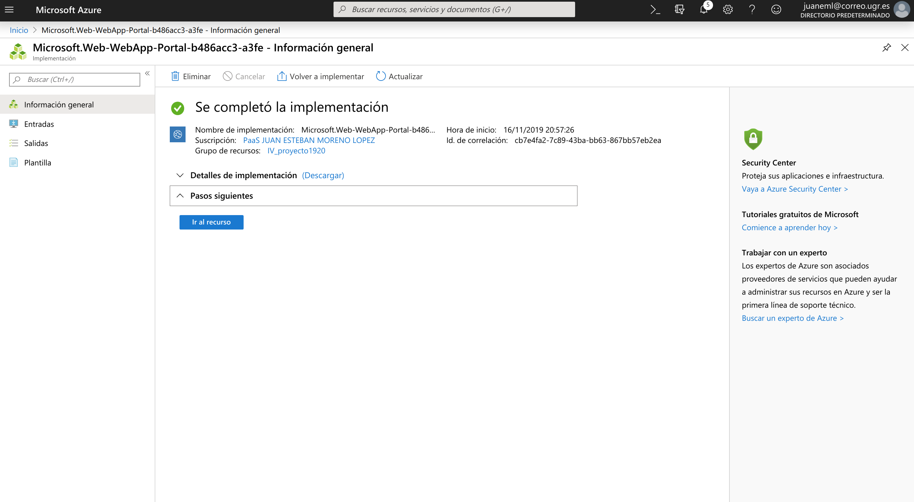
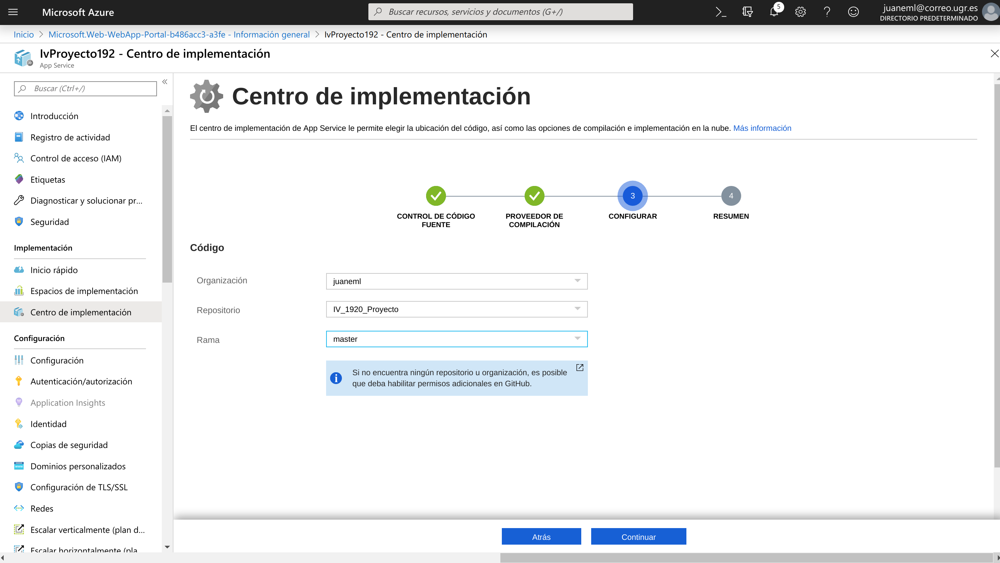
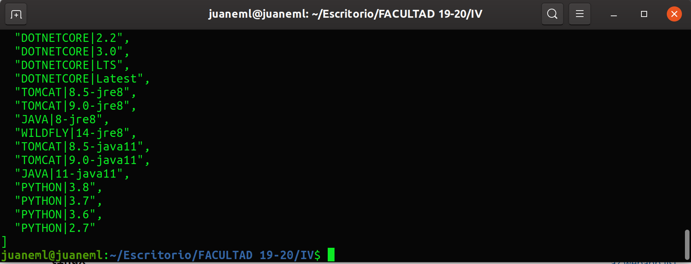

# PaaS Azure
# Despliegue de aplicación en [azure](https://azure.microsoft.com/es-es/free/search/?&ef_id=Cj0KCQiAiNnuBRD3ARIsAM8KmltdzErNaoJ-qfkq0dVgt7CPXJUWdD_4Ho5HnxzMa3sFBC_hGmw_OLMaAjxSEALw_wcB:G:s&OCID=AID2000115_SEM_VAab2G2A&MarinID=VAab2G2A_325806734845_azure_e_c__68954907492_aud-394034018130:kwd-49508422&lnkd=Google_Azure_Brand&dclid=COiOhNH5--UCFUbIUQodAS4MqQ)

- A continuación veremos los pasos para desplegar nuestra aplicación.

- Lo primero que tenemos que hacer es registrarnos en la plataforma de [azure](https://azure.microsoft.com/es-es/free/search/?&ef_id=Cj0KCQiAiNnuBRD3ARIsAM8KmltdzErNaoJ-qfkq0dVgt7CPXJUWdD_4Ho5HnxzMa3sFBC_hGmw_OLMaAjxSEALw_wcB:G:s&OCID=AID2000115_SEM_VAab2G2A&MarinID=VAab2G2A_325806734845_azure_e_c__68954907492_aud-394034018130:kwd-49508422&lnkd=Google_Azure_Brand&dclid=COiOhNH5--UCFUbIUQodAS4MqQ).

- Una vez que hemos iniciado sesión vamos a crear nuestra aplicación.

## Creación de la aplicación

- Vamos a `+` Crear un recurso, elegimos aplicación web, obtendremos una salida como esta:
  

### Supcrición

- Elegimos nuestra subscripción, en mi caso Student Starter, también está creada en la subcripción de la asignatura pero no puedo mostrarla ya que el crédito lo agoté.

- Elegimos un nombre para nuestro grupo de recursos en mi caso `IV_Proyecto_1920`

### Detalles de instancia

- **Nombre**: el nombre de nuestra aplicación, en mi caso proyecto-iv-19
- **Publicar**:Elegimos código.
- **Sistema operativo**: sistema Linux.
- **Región**: la que viene por defecto Central US.
- **Plan de App Service**: El que nos viene con la subscripción.

## Revisar y crear

- Revisamos que la configuración es la deseada y pasamos a crearla.
- Obtendremos una salida como esta:

- Una vez finalizada la creación tendremos una salida como esta:

## Implementación de la aplicación

- Vamos a Centro de implementación, tendremos una salida como esta:

- En ella añadimos la implementación continua, en mi caso del repositorio de GitHub para la asignatura, le damos a continuar y elegimos el repositorio, una vez configurado ya tendremos configurada la aplicación con el código de nuestro repositorio de Github, tendremos una salida como esta:

- En configurar nuestros dados:

- Para acabar le damos a finalizar y azure comenzará a recopilar la información de nuestro repositorio y a configurar lo necesario para que esté lista nuestra aplicación.

## Configurar

- Para que nuestra aplicación funcione correctamente,necesitamos configurarla para ello vamos a la sección de Configuración/Configuración general y añadimos el comando de inicio que queremos que se ejecute para desplegar nuestra aplicación en mi caso es con gunicorn:

~~~~
cd ./src && gunicorn proyecto_app:__hug_wsgi__ 
~~~~

- Una vez que hemos introducido el comando de inicio, Guardamos la configuración.

## Opción por comandos

- Lo primero que tenemos que hacer es descargarnos el CLI de Azure, consultamos el siguiente [enlace](https://docs.microsoft.com/es-es/cli/azure/install-azure-cli?view=azure-cli-latest)

- Buscamos nuestro sistema operativo, en mi caso Ubuntu, [cli azure ubuntu](https://docs.microsoft.com/es-es/cli/azure/install-azure-cli-apt?view=azure-cli-latest)

### Paso 1

- En un terminal escribimos el siguiente comando:

~~~~
curl -sL https://aka.ms/InstallAzureCLIDeb | sudo bash
~~~~

- Actualizamos e instalamos los certificados

~~~~
sudo apt-get update
sudo apt-get install ca-certificates curl apt-transport-https lsb-release gnupg
~~~~
  
### Paso 2

- Descargamos e instalamos la clave de firma de Microsoft:

~~~~
curl -sL https://packages.microsoft.com/keys/microsoft.asc | 
    gpg --dearmor | 
    sudo tee /etc/apt/trusted.gpg.d/microsoft.asc.gpg > /dev/null
~~~~

- Agregamos el repositorio de software de la CLI de Azure necesario:

~~~~
AZ_REPO=$(lsb_release -cs)
echo "deb [arch=amd64] https://packages.microsoft.com/repos/azure-cli/ $AZ_REPO main" | 
    sudo tee /etc/apt/sources.list.d/azure-cli.list
~~~~

### Paso 3
- Actualizamos la información del repositorio e instalamos el paquete de `azure-cli`
  
~~~~
sudo apt-get update
sudo apt-get install azure-cli
~~~~

## Pasamos a iniciar sesión mediante el comando `az login`

~~~~
az login
~~~~

## Pasamos a la implementación de nuestra aplicación

### Creamos el grupo de recursos
Consultamos,[resource group](https://docs.microsoft.com/es-es/cli/azure/group?view=azure-cli-latest#az-group-create)

az group create --location centralus -n IV_Proyecto_1920

- Comprobamos que exite el grupo de recursos.

~~~~
az group exists -n IV_Proyecto1920
~~~~

- Si todo ha ido bien obrendremos la salida con `true` y tendremos el recurso creado.

- Para ver las caracteristicas del grupo de recursos usamos:

~~~~
az group show -n IV_Proyecto_1920
~~~~

- Obtendremos una salida como est:
  

### Pasamos crear un app appservice plan

- Una vez finalizada la creación del grupo de recursos pasamos a la creación del `app service plan` el cual nos permite gestionar los planes de servicio de aplicaciones, consultamos [appservice plan](https://docs.microsoft.com/es-es/cli/azure/appservice/plan?view=azure-cli-latest#az-appservice-plan-create)

Usamos el comando `appservice plan` de la siguiente forma:

~~~~
az appservice plan create -g IV_Proyecto_1920 --is-linux --sku F1 -n FREE 
~~~~

## Procedemos a la creación de la aplicación

Pasamo a la creación de nuestra aplicación, consultamos
[az webapp create](https://docs.microsoft.com/es-es/cli/azure/webapp?view=azure-cli-latest#az-webapp-create)

Y para la configuración de python consultamos[app_python](https://docs.microsoft.com/en-us/cli/azure/webapp?view=azure-cli-latest#az-webapp-list-runtimes)
Creamos una aplicación web con Python 3.7 y desplegamos de nuestro repositorio local de git.

Para saber el runtime necesario  para python y nuestra versión consultamos con el comando
~~~~
az webapp list-runtimes --linux
~~~~
Y veremos todas las disponibles para linux que es el sistema que necesito.

- Obtendremos una salida como esta
- 

~~~~
az webapp create --resource-group IV_Proyecto_1920 --plan FREE --name proyecto-iv-19  --deployment-source-url https://github.com/juaneml/IV_1920_Proyecto
~~~~

- `--resource-group`, le indicamos el recurso, en mi caso IV_Proyecto_1920.
  
- `plan`, le indicamos el plan que hemos definido en mi caso, FREE.

- `--name`, el nombre de nuestra aplicación,en mi caso proyecto-iv-19.

- `--deployment-source-url`, la url del código que vamos a desplegar en mi caso de Github.

Al finalizar ya tendremos nuestra aplicación.

## Para finalizar

- Vamos a la sección de introducción iniciamos la apliación si no está iniciada y para ver nuestra aplicación desplegado accedemos a URL y obtendremos una salida como esta:

Ya tenemos nuestra aplicación desplegada en la plataforme de azure.