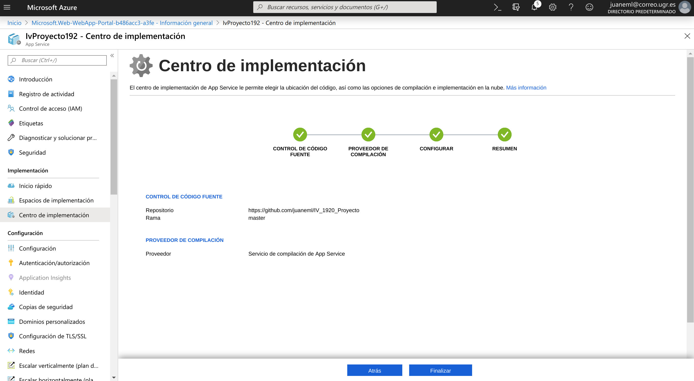
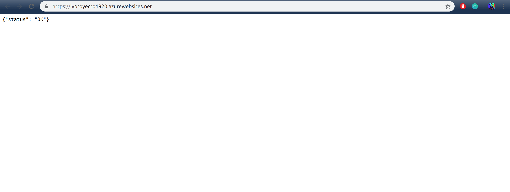

# PaaS Azure
# Despliegue de aplicación en [azure](https://azure.microsoft.com/es-es/free/search/?&ef_id=Cj0KCQiAiNnuBRD3ARIsAM8KmltdzErNaoJ-qfkq0dVgt7CPXJUWdD_4Ho5HnxzMa3sFBC_hGmw_OLMaAjxSEALw_wcB:G:s&OCID=AID2000115_SEM_VAab2G2A&MarinID=VAab2G2A_325806734845_azure_e_c__68954907492_aud-394034018130:kwd-49508422&lnkd=Google_Azure_Brand&dclid=COiOhNH5--UCFUbIUQodAS4MqQ)

- A continuación veremos los pasos para desplegar nuestra aplicación.

- Lo primero que tenemos que hacer es registrarnos en la plataforma de [azure](https://azure.microsoft.com/es-es/free/search/?&ef_id=Cj0KCQiAiNnuBRD3ARIsAM8KmltdzErNaoJ-qfkq0dVgt7CPXJUWdD_4Ho5HnxzMa3sFBC_hGmw_OLMaAjxSEALw_wcB:G:s&OCID=AID2000115_SEM_VAab2G2A&MarinID=VAab2G2A_325806734845_azure_e_c__68954907492_aud-394034018130:kwd-49508422&lnkd=Google_Azure_Brand&dclid=COiOhNH5--UCFUbIUQodAS4MqQ).

- Una vez que hemos iniciado sesión vamos a crear nuestra aplicación.

## Creación de la aplicación

- Vamos a `+` Crear un recurso, elegimos aplicación web, obtendremos una salida como esta:
  

### Supcrición

- Elegimos nuestra subscripción, en mi caso Student Starter, también está creada en la subcripción de la asignatura pero no puedo mostrarla ya que el crédito lo agoté.

- Elegimos un nombre para nuestro grupo de recursos en mi caso `IV_Proyecto_1920`

### Detalles de instancia

- **Nombre**: el nombre de nuestra aplicación, en mi caso proyecto-iv-19
- **Publicar**:Elegimos código.
- **Sistema operativo**: sistema Linux.
- **Región**: la que viene por defecto Central US.
- **Plan de App Service**: El que nos viene con la subscripción.

## Revisar y crear

- Revisamos que la configuración es la deseada y pasamos a crearla.
- Obtendremos una salida como esta:

- Una vez finalizada la creación tendremos una salida como esta:

## Implementación de la aplicación

- Vamos a Centro de implementación, tendremos una salida como esta:

- En ella añadimos la implementación continua, en mi caso del repositorio de GitHub para la asignatura, le damos a continuar y elegimos el repositorio, una vez configurado ya tendremos configurada la aplicación con el código de nuestro repositorio de Github, tendremos una salida como esta:

- En configurar nuestros dados:

- Para acabar le damos a finalizar y azure comenzará a recopilar la información de nuestro repositorio y a configurar lo necesario para que esté lista nuestra aplicación.

## Configurar

- Para que nuestra aplicación funcione correctamente,necesitamos configurarla para ello vamos a la sección de Configuración/Configuración general y añadimos el comando de inicio que queremos que se ejecute para desplegar nuestra aplicación en mi caso es con gunicorn:

~~~~
cd ./src && gunicorn proyecto_app:__hug_wsgi__ 
~~~~

- Una vez que hemos introducido el comando de inicio, Guardamos la configuración.

## Para finalizar

- Vamos a la sección de introducción iniciamos la apliación si no está iniciada y para ver nuestra aplicación desplegado accedemos a URL y obtendremos una salida como esta:

Ya tenemos nuestra aplicación desplegada en la plataforme de azure.