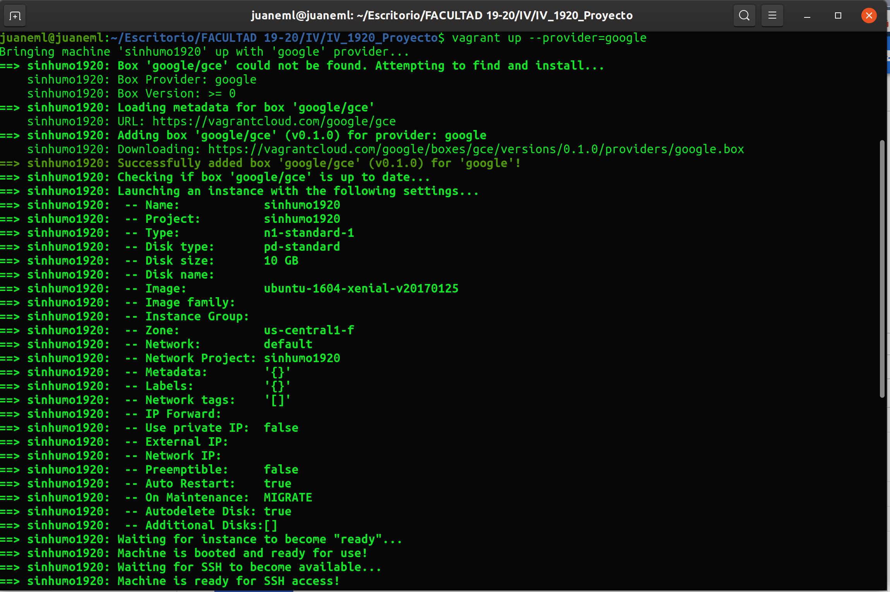
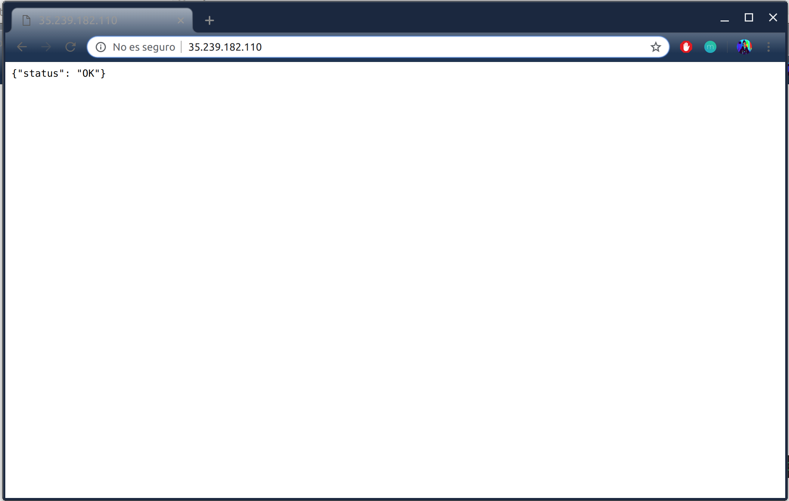
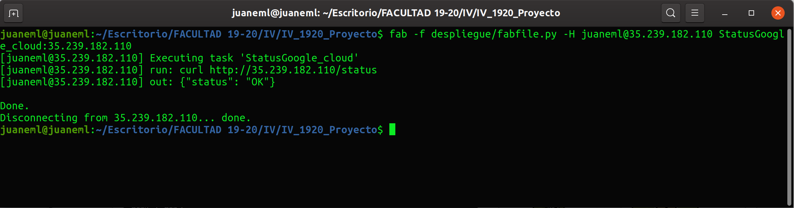

# Despliegue desde 0, azure

- Para llevar a cabo el despliegue tenemos que hacer la instalación de herramientas tales como,
[Vagrant](https://www.vagrantup.com/), [ansible](https://www.ansible.com/), [fabric](https://get.fabric.io/).

## Azure
- Antes de comenzar a usar azure y poder desplegar nuestro servicio necesitamos:
Instalar azure [cli](https://docs.microsoft.com/en-us/cli/azure/install-azure-cli?view=azure-cli-latest)
que nos va a permitir conectarnos a nuestra suscripción de azure y crear nuestra máquina virtual.

Una vez instalada la herramienta Vagrant y la herramienta que nos proporciona azure, procedemos con los siguientes pasos:

### Paso 1

~~~
az login
~~~

Con el siguiente comando iniciamos sesión en nuestra suscripción de azure, se nos abrirá una
ventana en el navegador e iniciamos sesión.

### Paso 2

~~~
az ad sp create-for-rbac
~~~

- Para crear una aplicación de Azure Active Directory con acceso a Azure Resource Manager para la suscripción actual de Azure

### Paso 3

~~~
az account list --query "[?isDefault].id" -o tsv
~~~

para obtener tu ID de suscripción de Azure.

### Paso 4

~~~
az ad sp create-for-rbac
~~~

debe ser similar a la siguiente:

~~~
{
  "appId": "XXXXXXXX-XXXX-XXXX-XXXX-XXXXXXXXXXXX",
  "displayName": "some-display-name",
  "name": "http://azure-cli-2019-12-23-18-51-03"",
  "password": "XXXXXXXXXXXXXXXXXXXX",
  "tenant": "XXXXXXXX-XXXX-XXXX-XXXX-XXXXXXXXXXXX"
}
~~~

Los valores tenant, appId y password asignan a los valores de configuración azure.tenant_id, azure.client_idy azure.client_secreten su archivo o variables de entorno Vagrant.

## Creación del Vagrantfile

Para la creación del Vagranfile es necesario hacer las exportaciones de las variables de azure que necesita vagrant:

- AZURE_SUBSCRIPTION_ID = Resultado Paso 3
- AZURE_CLIENT_ID = Paso 4 campo appId
- AZURE_TENANT_ID = Paso 4 campo tenant
- AZURE_CLIENT_SECRET = Paso 4 campo password

Abrimos terminal y exportamos las variables:

~~~
export AZURE_SUBSCRIPTION_ID="XXXXXXXX-XXXX-XXXX-XXXX-XXXXXXXXXXXX"
export AZURE_CLIENT_ID="XXXXXXXX-XXXX-XXXX-XXXX-XXXXXXXXXXXX"
export AZURE_TENANT_ID="XXXXXXXX-XXXX-XXXX-XXXX-XXXXXXXXXXXX"
export AZURE_CLIENT_SECRET="XXXXXXXX-XXXX-XXXX-XXXX-XXXXXXXXXXXX"
~~~

Una vez exportadas las variables procedemos a la creación del Vagrantfile.

## Comentamos que hemos hecho

~~~
vagrant box add cloud_azure https://github.com/azure/vagrant-azure/raw/v2.0/dummy.box --provider azure
~~~

- Con el siguiente comando le estamos diciendo a vagrant que cree un box llamado cloud_azure indicándole el destino donde está y el proveedor azure.

- Mi [Vagrantfile](../Vagrantfile) quedaría como sigue:

~~~~
Vagrant.configure('2') do |config|
  config.vm.box = "cloud_azure"

    # use local ssh key to connect to remote vagrant box
    
    config.ssh.private_key_path = '~/.ssh/id_rsa'
    cloud_azure.vm.provider :azure do |azure, override|
  
    # each of the below values will default to use the env vars named as below if not specified explicitly
    
      azure.tenant_id = ENV['AZURE_TENANT_ID']
      azure.client_id = ENV['AZURE_CLIENT_ID']
      azure.client_secret = ENV['AZURE_CLIENT_SECRET']
      azure.subscription_id = ENV['AZURE_SUBSCRIPTION_ID']
  
      azure.vm_name = 'sinhumo1920'
      azure.vm_size = 'Standard_DS2_v2'
      azure.location = 'westeurope'
      azure.tcp_endpoints = "80"
      azure.resource_group_name = 'sinhumo1920'
      azure.vm_image_urn = 'canonical:ubuntuserver:16.04.0-LTS:latest'
  
      # Evitar que busque actualizaciones
      config.vm.box_check_update = false
  
      # dns_name
      azure.dns_name = 'sinhumo1920'
  
      end
    end
~~~~

- Con el archivo [Vagranfile](../Vagrantfile), indicamos que tengamos conexión a nuestra máquina virtual mediante ssh por la configuración
~~~~
  config.ssh.private_key_path = '~/.ssh/id_rsa'
~~~~

y el puerto 80.

~~~~
azure.tcp_endpoints = 80
~~~~

- El nombre de nuestra máquina virtual es sinhumo1920.

- Con un tamaño Standard_DS2_v2 "que nos proporciona uso equilibrado de la CPU en proporción de memoria. Ideal para desarrollo y pruebas, bases de datos pequeñas o medianas, y servidores web de tráfico bajo o medio".

- [Consultado](https://docs.microsoft.com/es-es/azure/virtual-machines/windows/sizes)

~~~~
azure.location = 'westeurope'
~~~~

- Le indicamos dónde queremos alojar nuestra máquina.

- Con vm_image_urn le indicamos la imagen de la máquina virtual.
  
~~~~
azure.vm_image_urn = 'canonical:ubuntuserver:16.04.0-LTS:latest'
~~~~

- Con  dns_name el nombre del dns:

~~~~
 azure.dns_name = 'sinhumo1920'
~~~~

- Con resource_group_name el grupo de recursos:
  
~~~
resource_group_name = 'sinhumo1920'
~~~

- Evitamos que busque actualizaciones.
  
~~~
vm.box_check_update
~~~

- Por último le decimos que vamos a provisionar con ansible, le indicamos el modo de compatibilidad y la versión el resultado es el siguiente:
  
~~~
config.vm.provision "ansible" do |ansible|
    ansible.compatibility_mode = "2.0"
    ansible.version = "2.8.3"
    ansible.playbook = "provision/playbook.yml"

  end
~~~

- También necesitamos instalar el plugin de azure para vagrant con el comando:
  
~~~
vagrant plugin instalar vagrant-azure
~~~

- Y por último para levantar nuestra máquina hacemos uso del comando:
  
~~~
vagrant up --provider = azure
~~~

- En la siguiente captura podemos ver el resultado:

- En la siguiente captura podemos ver el resultado de ansible:

### Enlaces consultados:

- [Tutorial](https://github.com/Azure/vagrant-azure/blob/v2.0/README.md)
  
- [Configuración Vagrantfile-1](https://github.com/Azure/vagrant-azure/blob/v2.0/README.md)

- [Configuración Vagrantfile-2](https://azure.microsoft.com/es-es/resources/videos/azure-virtual-machine-creation-and-set-up-using-vagrant-with-corey-fowler/)

- [az Comandos](https://docs.microsoft.com/en-us/cli/azure/ad/app?view=azure-cli-latest)

- [Lista plugin Vagrant](https://github.com/hashicorp/vagrant/wiki/Available-Vagrant-Plugins)

- [Configuración vagrant con ansible](https://www.vagrantup.com/docs/provisioning/ansible.html)

### Para conectarnos mediante ssh a nuestras máquinas

- Conectar

~~~
 vagrant ssh cloud_azure
~~~

Obtenemos la siguiente salida:

### Para parar nuestra máquina virtual ejecutamos el comando:

- Apagar

~~~
 vagrant halt
~~~

# GOOGLE CLOUD

- Procedemos ahora a con [GooGle Cloud](https://cloud.google.com).
  
- Para poder desplegar en GooGle Cloud tenemos que seguir los siguientes pasos:
  
### Instalación del plugin para vagrant:

~~~~
vagrant pluging install vagrant-google
~~~~

### Intalación del box

~~~~
    vagrant box add gce https://github.com/mitchellh/vagrant-google/raw/master/google.box

~~~~

Para poder trabajar con nuestro proyecto de Google Cloud instalamos **Cloud SDK**.

Seguimos los pasos de la [documentación](https://cloud.google.com/sdk/docs/downloads-apt-get)

1. Creamos una variable de entorno para lograr la distribución correcta:

~~~~
export CLOUD_SDK_REPO="cloud-sdk-$(lsb_release -c -s)"
~~~~

2. Agregamos  el URI de distribución del SDK de Cloud como una fuente de paquete:

~~~~
echo "deb http://packages.cloud.google.com/apt $CLOUD_SDK_REPO main" | sudo tee -a /etc/apt/sources.list.d/google-cloud-sdk.list
~~~~

3. Importamos la clave pública de Google Cloud:

~~~~
curl https://packages.cloud.google.com/apt/doc/apt-key.gpg | sudo apt-key add -
~~~~

4. Actualizamos el SDK de Cloud y lo instalamos:

~~~~
sudo apt-get update && sudo apt-get install google-cloud-sdk
~~~~

- En la instalación tendremos que ir repondiendo preguntas para poder configurar correctamente la herramienta, cosas como el proyecto con el que vamos a trabajar, necesarias para que podamos usar la herramienta.

5. Iniciamos `gcloud init` para iniciar.
  
- Iniciaremos sesión con nuestra cuenta en el navegador y eligiremos nuestro proyecto que previamente hemos creado.

- Una vez hecho esto creamos la clave para conectarnos por ssh:

~~~~
gcloud compute config-shh
~~~~

### Procedemos al fichero de configuración Vagrant para google cloud.

- Mi configuración para google cloud es la siguiente:  

~~~~
Vagrant.configure('2') do |config|
    config.vm.box = "google/gce"

#configuración para google cloud
    config.vm.define :sinhumo1920 do |sinhumo1920|
        sinhumo1920.vm.box = "google/gce"
        sinhumo1920.vm.network "forwarded_port", guest: 22, host: 2222
        sinhumo1920.vm.network "forwarded_port", guest: 80, host: 80
        sinhumo1920.vm.network "forwarded_port", guest: 8000, host: 8000
        sinhumo1920.vm.synced_folder ".", "/vagrant", disabled: true, type: "rsync"
        
        sinhumo1920.vm.provider :google do |google, override|
            google.google_project_id = ENV['GOOGLE_PROJECT_ID']
            google.google_json_key_location = ENV['GOOGLE_KEY_LOCATION']
            google.name = "sinhumo1920"
            google.image = "ubuntu-1604-xenial-v20170125"
            override.ssh.username = ENV['GOOGLE_SSH_USER']
            override.ssh.private_key_path = ENV['GOOGLE_SSH_KEY_LOCATION']
        end
    end
  
    # Configuración  para provisionar con ansible
      config.vm.provision "ansible" do |ansible|
      ansible.compatibility_mode = "2.0"
      ansible.version = "2.8.3"
      ansible.playbook = "provision/playbook.yml"
  
    end
  end
~~~~

### Para que la configuración de vagrant para Google Cloud pueda realizarse previamente tenemos que exportar las variables de entorno:

#### Exportamos las variables en un terminal

~~~~
export GOOGLE_PROJECT_ID="sinhumo1920"
export GOOGLE_CLIENT_EMAIL="xxxxxxxxxxxx-compute@developer.gserviceaccount.com"
export GOOGLE_KEY_LOCATION="~/sinhumo1920-xxxxxxxxxxxx.json"
export GOOGLE_SSH_USER=$USER
export GOOGLE_SSH_KEY_LOCATION="~/.ssh/google_compute_engine"
~~~~

#### Vamos a proceder a explicar que son estas variables:

- GOOGLE_PROJECT_ID: es el id del proyecto.

- GOOGLE_CLIENT_EMAIL: es la identificación que genera google y la podemos encontrar accediendo a, la sección `IAM y Administración` , `IAM` , `PERMISOS`,
- 

- GOOGLE_KEY_LOCATION: en `IAM y Administración`, `Cuentas de servicio`. Guardamos la clave en nuestra máquina y especificamos la ruta a la clave.

- GOOGLE_SSH_USER: nuestro usuario.

- GOOGLE_SSH_KEY_LOCATION: indicamos nuestra ruta a la clave SSH, que hemos anteriormente.

### Desplegamos la máquina virtual, usamos el siguite comando:

~~~~
vagrant up --provider=google
~~~~

- Obtenemos la siguiente salida:

- Salida de ansible:

- Instancia de la máquina virtual en google cloud:

- Creamos las reglas del firewall con el siguiente comando:

~~~~  
gcloud compute firewall-rules create allow80 --allow tcp:80 --source-tags=sinhumo1920 --source-ranges=0.0.0.0/0 --description="Allow tcp 80"
~~~~

Para evitar problemas al lanzar nuestra aplicación en google cloud.

### Conexión ssh

~~~~
vagrant ssh sinhumo1920
~~~~

# Ansible

- Para aportar el provisionamiento a la máquina virtual hago uso de ansible.

- Ansible lo que nos permite una vez creada la máquina provisionar de utilidades que necesita nuestra máquina, de forma que automaticemos el aprovisionamiento, tales como instalaciones de paquetes como pip3, git, la clonación de nuestro repositorio y la instalación de los requirements necesarios definidos en nuestro repositorio y que nuestra máquina necesita para desplegarse y lanzar nuestro microservicio.

- El archivo necesario tiene extensión .yml tiene el nombre de [playbook.yml](../provision/playbook.yml).

- Mi playbook.yml tiene el siguiente contenido:

~~~
---
    - hosts: all
      become: yes
      tasks:
    
        # Instalacion de git
        - name: Instala git
          apt: pkg=git force_apt_get=yes  state=present 
    
        # Clonamos Repositorio
    
        - name: Clonar nuestro repositorio en github
          git:
            repo: https://github.com/juaneml/IV_1920_Proyecto.git
            dest: proyectoiv19/
          become: no
    
        #Actualizamos repositorios
    
        - name: update repositorio
          apt:
            update_cache: yes 
          become: yes 
    
        #upgrade repositorios
        - name: upgrade all packets to the last version
          apt:
            upgrade: dist
          become: yes
        #Instalamos python3
    
        - name: Instalación python3
          apt: pkg=python3-pip state=latest
          become: yes
    
      # Instalamos pip3
    
        - name: Instalación pip3
          apt: pkg=python3-pip state=latest
    
          become: yes

      # instalamos requisitos necesarios para psycopg2

        - name: install prerequisites
          apt: 
          
            pkg: ['libpq-dev', 'python3-psycopg2']
          
          become: yes

      # Instalamos Requirements necesarios para nuestro microservicio
    
        - name: Install requirements.txt
          command: pip3 install -r proyectoiv19/requirements.txt 
          
          become: yes
~~~~

- Para comprobar que hemos escrito bien el playbook.yml, ejecutamos el siguiente comando:

~~~
ansible-playbook provision/playbook.yml --syntax-check
~~~

- Si queremos volver a provisionar una vez creada nuestra máquina, podemos hacerlo mediante al comando:

~~~
vagrant provision
~~~

## Enlaces consultados:
- [Documentación](https://docs.microsoft.com/en-us/azure/virtual-machines/linux/ansible-install-configure?toc=%2Fen-us%2Fazure%2Fansible%2Ftoc.json&bc=%2Fen-us%2Fazure%2Fbread%2Ftoc.json#file-credentials).

- Como uso python3 instalo como dice la [documentación](https://docs.python-guide.org/starting/install3/linux/).
- Para añadir el repositorio consulto [1](https://docs.python-guide.org/starting/install3/linux/) y consulto [2](https://blog.jetbrains.com/pycharm/2017/12/developing-in-a-vm-with-vagrant-and-ansible/).

## Fabric

- Para el despliegue y ejecución de la aplicación, hago uso de Fabric.
  
- Nos permite ejecutar comandos de shell de forma remota a través de SSH.

- Mi [fabfile](../despliegue/fabfile.py) tiene el siguiente contenido:
~~~
#!/usr/bin/env python
# -*- coding: utf-8 -*-
from fabric.api import *

# Muestra el estado del DNS de nuestra app en azure

def StatusDns_azure():
    run('curl http://sinhumo1920.westeurope.cloudapp.azure.com/status')

# Muesta el estado de nuesta app en google cloud

def StatusGoogle_cloud(ip):
    run('curl http://'+ip+'/status')

# Funcion para mantener la version anterior del microservicio

def GuardaVersionAnterior():
    run('cp -r ./proyectoiv19 oldproyectoiv19')

# Funcion para eliminar la version anterior
def EliminarVersionAnterior():
    run('rm -rf ./oldproyectoiv19')

# Funcion para eliminar el microservicio
def EliminarVersion():
    run('rm -rf ./proyectoiv19')

# Funcion para instalar requirements
def InstallReq():
    run('pip3 install -r ./proyectoiv19/requirements.txt')

# Funcion para clonar el repositorio
def ClonRepo():
    run('git clone https://github.com/juaneml/IV_1920_Proyecto.git proyectoiv19/')

# Funcion que actualiza el microservicio guardando una version anterior
# Para ello hacemos la llamada de la funcion GuardaVersionAnterior
# Posteriormente clonamos el repositorio del microservicio con la funcion ClonRepo
# Por ultimo instalamos requirements haciendo uso de la funcion InstallReq

def MicroservicioSecure():
    ## Se guarda la version anterior
    GuardaVersionAnterior()
    # Eliminamos contenido
    EliminarVersion()
    # Clonamos nuestro respositorio de github
    ClonRepo()
    ## Instalamos requirements.txt
    InstallReq()

# Funcion que actualiza el microservicio  sin la version anterior
# Para ello hacemos la llamada de la funcion EliminarVersion
# Posteriormente clonamos el repositorio del microservicio con la funcion ClonRepo
# Por ultimo instalamos requirements haciendo uso de la funcion InstallReq

def MicroservicioClean():
    # Eliminamos la carpeta almacenada y hacemos una clonacion del
    # repositorio
    EliminarVersion()
    ClonRepo()
    ## Instalamos requirements.txt
    InstallReq()

def Makedepen():
    #Lanzamos makefile
    run(' sudo apt-get install npm && sudo make dependences')

# Funcion para iniciar el microservicio
def LanzarApp():
    run('cd ./proyectoiv19/src/ &&  sudo gunicorn proyecto_app:__hug_wsgi__ -b 0.0.0.0:80 --name proyecto')

# Funcion para parar el microservicio
def StopApp():
    run('sudo pkill -f gunicorn')

~~~

- El método StatusDns_azure comprueba nuestra url de azure con el uso de curl.

- El método StatusGoogle_cloud comprueba nuestra url de google con el uso de curl donde recibe un parámetro, la ip de nuestra url.
  
- El método GuardaVersionAnterior, guarda la versión anterior.

- El método EliminarVersionAnterior, elimina la versión anterior creada.

- El método EliminarVersion, elimina la carpeta almacenada.

- El método InstallReq, instala los requirements.

- El método ClonRepo, clona nuestro repositorio.

- El método MicroservicioSecure, guarda la versión anterior, clona nuestro repositorio e instala los requirements.

- El método MicroservicioClean, elimina la carpeta almacenada, clona nuestro repositorio e instala los requirements.
- El método LanzarApp, iniciamos la aplicación.
- El método StopApp, detenemos la aplicación.

## Para ejecutar cualquier método para nuesta máquina en azure haremos uso del comando siguiente:

## **Azure**
~~~
fab -f despliegue/fabfile.py -H vagrant@ip_maquina_azure metodo_deseado
~~~

## Para ejecutar cualquier método para nuestra máquina en Google Cloud haremos uso del comando siguiente:

## **Google Cloud**
~~~~
fab -f despliegue/fabfile.py -H juaneml@ip_maquina_google metodo_deseado
~~~~

# Iniciar Servicio en Azure

### Para realizar el despliegue del microservicio en azure ejecutamos el comando:
  
~~~
fab -f despliegue/fabfile.py -H vagrant@ip_maquina_azure LanzarApp
~~~

# Iniciar Servicio en Google Cloud

### Para realizar el despliegue del microservicio en Google Cloud ejecutamos el comando:

~~~~
fab -f despliegue/fabfile.py -H juaneml@ip_maquina_google LanzarApp
~~~~  

# Resultados

# **Azure**
## Iniciar microservicio

- Como podemos ver en la siguiente captura el microservicio está iniciado.

## Navegador

## StatusDns Azure

## Parar el microservicio

# **Google Cloud**

## Navegador

- El comando seguido de `:` nos permite pasarle el parámetro que necesita nuestra función.

## StatusDns Google Cloud

- Comando:
  
~~~~
fab -f despliegue/fabfile.py -H juaneml@ip_google_cloud StatusGoogle_cloud:ip_google_cloud
~~~~ 

## Parar el microservicio 

[Documentación](http://www.fabfile.org/)
