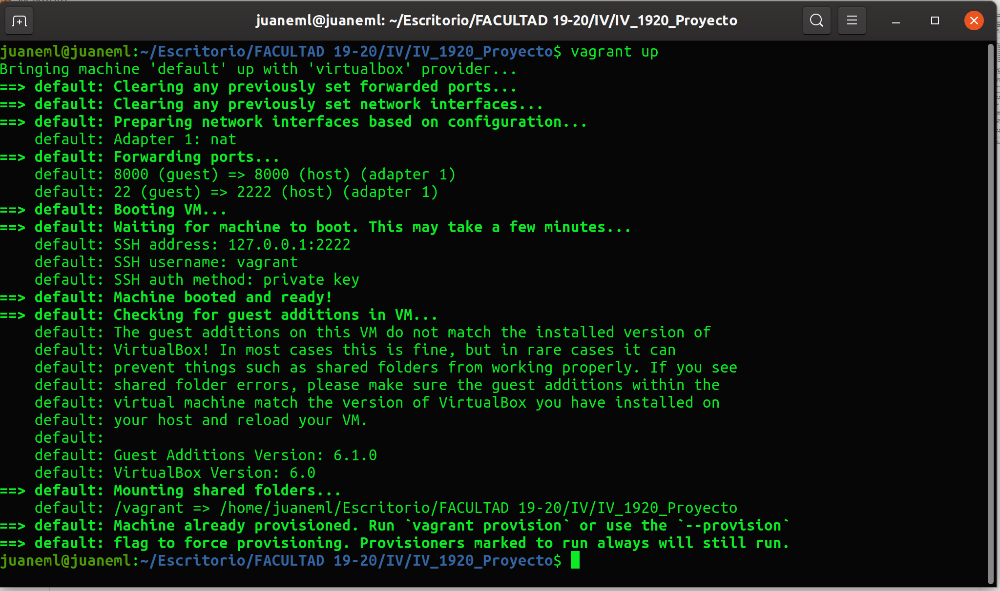
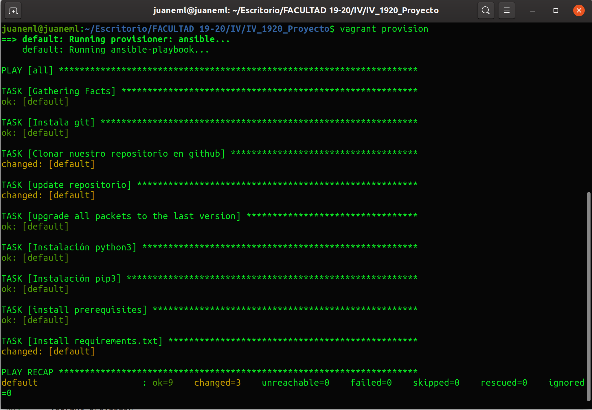
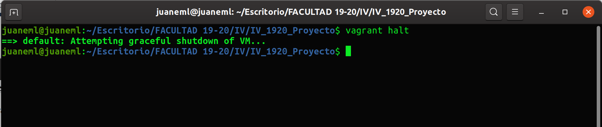
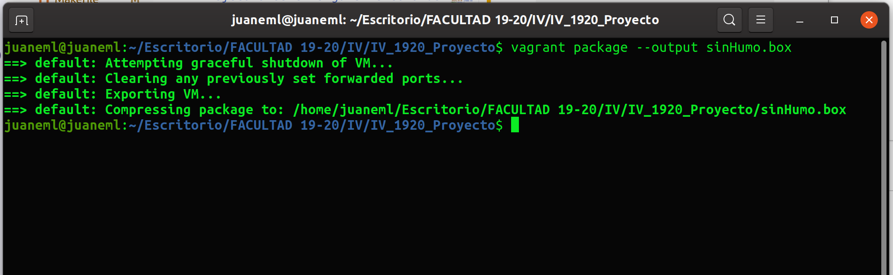
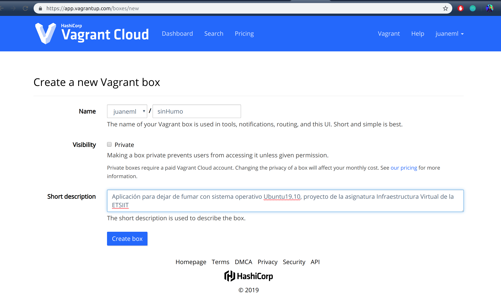
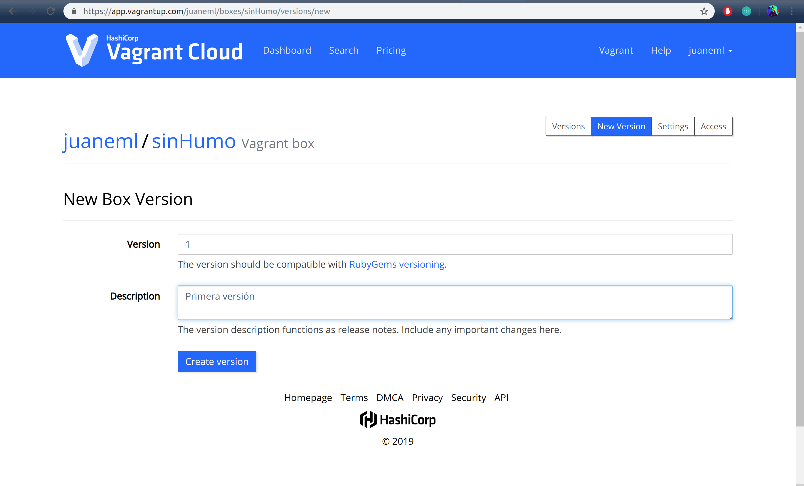
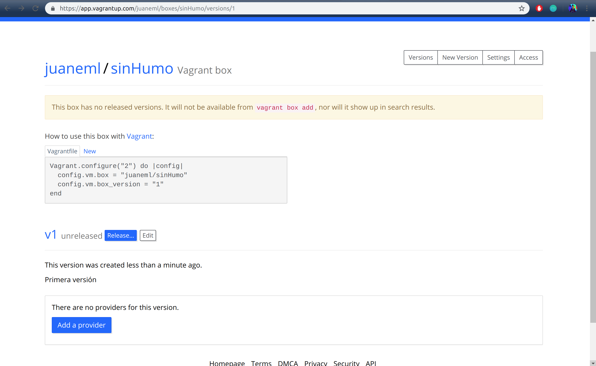

# Provisionamiento
- Para el provisionamiento vamos hacer uso de vagrant, para poder hacer uso de vagrant tenemos que tener instalado [Virtualbox](https://www.virtualbox.org/) un programa que nos permitirá virtualizar nuestra máquina.
  
# Creación del Vagrantfile

- Para ello necesitamos crear un archivo con nombre `Vagrantfile` en el que añadiremos la configuración necesaria para la creación de nuestra máquina.

- Mi [Vagrantfile](../Vagrantfile)

~~~~
    Vagrant.configure('2') do |config|
    config.vm.box = "bento/ubuntu-19.10"

        # Evitar que busque actualizaciones
        config.vm.box_check_update = false

        # configuramos la red de nuestra máquina
        config.vm.network "forwarded_port", guest: 8000, host: 8000

    
    # Configuración  para provisionar con ansible
        config.vm.provision "ansible" do |ansible|
            ansible.compatibility_mode = "2.0"
            ansible.version = "2.8.3"
            ansible.playbook = "provision/playbook.yml"
        end
    end
~~~~

- Pasamos a explicar nuestro `Vagrantfile`:
  
- `Vagrant.configure('2') do |config|` indicamos la versión de configuración de Vagrant, en nuestro caso `2`para que sea compatible con anteriores y con las siguientes.
  
- `config.vm.box = "bento/ubuntu-19.10"`, configuramos el sistema operativo en mi caso `ubuntu-19.10` creada con [Bento](https://app.vagrantup.com/bento/boxes/ubuntu-19.10) por [Chef](https://supermarket.chef.io/), se ha elegido este sistema operativo porque es el que se utiliza en la máquina de trabajo y como es el ubuntu más reciente facilmente se pueden arreglar errores que puedan surgir en el futuro.
  
- Para que en nuestra máquina funcione la conexión con nuestra aplicación y podamos lanzarla, tenemos que configurar la red de nuestra máquina, para ello hacemos uso del siguiente comando: `config.vm.network "forwarded_port", guest: 8000, host: 8000` donde indicamos que el puerto donde escucha es el 8000, puerto que usa nuestro framework [Hug](https://www.hug.rest/website/quickstart).
- Visitada la documentación de vagrantup, [networking](https://www.vagrantup.com/docs/networking/basic_usage.html)

- Por último y no menos importante indicamos el mecanismo de provisionamiento que vamos a utilizar, en mi caso hago uso de [Ansible](https://docs.ansible.com/ansible/latest/user_guide/playbooks.html?extIdCarryOver=true&sc_cid=701f2000001OH7YAAW).
- Con `config.vm.provision "ansible" do |ansible|` indicamos que vamos a provisionar con ansible.
- Para evitar `warnings` en la ejecución de ansible añadimos la siguiente configuración:
- `ansible.compatibility_mode = "2.0"`, donde indicamos que use ansible en modo de compatibilidad.
- `ansible.version = "2.8.3"`, donde indicamos que use la versión actual `2.8.3`, versión que tengo instalada en mi máquina de trabajo.
  
- Levantamos la máquina haciendo uso del siguiente comando:

~~~
vagrant up
~~~

- Salida:
  

- Provisionamos nuestra máquina con el siguiente comando:
  
~~~~
vagrant provision
~~~~  

- Salida:
  

- Apagamos la máquina con el siguiente comando:
  
~~~~
vagrant halt
~~~~

- Salida:
  

# Provisionamiento con Ansible

- Como comentaba antes, para aportar el provisionamiento a la máquina virtual hago uso de ansible.

- Ansible lo que nos permite una vez creada la máquina virtual es provisionar de utilidades que necesita nuestra máquina, de forma que automaticemos el aprovisionamiento, tales como instalaciones de paquetes como pip3, git, la clonación de nuestro repositorio y la instación de los requirements necesarios definidos en nuestro repositorio y que nuestra máquina necesita para lanzar nuestro microservicio.

- El archivo necesario tiene extensión .yml y como nombre [playbook.yml](../provision/playbook.yml).

- Mi playbook.yml tiene el siguiente contenido:

~~~~
---
    - hosts: all
      become: yes
      tasks:
    
        # Instalacion de git
        - name: Instala git
          apt: pkg=git force_apt_get=yes  state=present 
    
        # Clonamos Repositorio
    
        - name: Clonar nuestro repositorio en github
          git:
            repo: https://github.com/juaneml/IV_1920_Proyecto.git
            dest: proyectoiv19/
          become: no
    
        #Actualizamos repositorios
    
        - name: update repositorio
          apt:
            update_cache: yes 
          become: yes 
    
        #upgrade repositorios
        - name: upgrade all packets to the last version
          apt:
            upgrade: dist
          become: yes
        #Instalamos python3
    
        - name: Instalación python3
          apt: pkg=python3.7 state=present
          become: yes
    
      # Instalamos pip3
    
        - name: Instalación pip3
          apt: pkg=python3-pip state=latest
    
          become: yes

      # instalamos requisitos necesarios para psycopg2

        - name: install prerequisites
          apt: 
          
            pkg: ['libpq-dev', 'python3-psycopg2']
          
          become: yes

      # Instalamos Requirements necesarios para nuestro microservicio
    
        - name: Install requirements.txt
          command: pip3 install -r proyectoiv19/requirements.txt 
          
          become: yes

~~~~

- Para comprobar que hemos escrito bien el playbook.yml, ejecutamos el siguiente comando:
  
~~~~
  ansible-playbook provision/playbook.yml --syntax-check
~~~~

- Si queremos volver a provisionar una vez creada nuestra máquina, podemos hacerlo mediante el comando:

~~~~
 ansible-playbook provision/playbook.yml --syntax-check
~~~~

- Comentamos la configuración de nuestro archivo playbook.yml
  
- Indicamos  con `host: all` que es para todas las máquinas
- Con `task` indicamos las tareas que va a ejecutar ansible.
- Etiqueta `name` indicamos el nombre de la tarea.
  
- `name: Instala git
          apt: pkg=git force_apt_get=yes  state=present ` indicamos que instale git.

-  `name: Clonar nuestro repositorio en github
          git:
            repo: https://github.com/juaneml/IV_1920_Proyecto.git dest: proyectoiv19 become: no` 
    indicamos que clone nuestro repositorio de github y con become sin privilegios.

-  `name: update repositorio
          apt:
            update_cache: yes 
          become: yes `
actualizamos repositorio.

- `name: upgrade all packets to the last version
          apt:
            upgrade: dist
          become: yes` 
actualizamos todos los paquetes a la última versión.

- `- name: Instalación python3
          apt: pkg=python3.7 state=present
          become: yes` instalamos python3 versión 3.7.

- ` name: install prerequisites
          apt: 
            pkg: ['libpq-dev', 'python3-psycopg2']
          become: yes`
instalamos requisitos necesarios para instalar psycopg2 necesario para el posterior uso de postgresql.

- Por último, Instalamos Requirements necesarios para nuestro microservicio `
          name: Install requirements.txt
          command: pip3 install -r proyectoiv19/requirements.txt` 

# Vagrant Cloud

Después de haber creado nuestra máquina, vamos a subirla a [Vagrant Cloud](https://www.vagrantup.com/).
- Para ello nos creamos una cuenta, una vez creada pasamos a crear nuestra `box`.

- Hacemos uso del comando:

~~~~
vagrant package --output sinHumo.box
~~~~

- Mi box le ha llamado sinHumo.box, la salida es la siguiente:

- Pasamos a subir nuestro paquete, `sinHumo` para ello nos vamos a la página y nos dirigimos a  `new vagrant box`, obtendremos una salida como esta:

.

- Indicamos el nombre de nuestro paquete y una breve descripción, para indicar que incluye nuestro paquete.

- El siguiente paso, indicamos la versión en mi caso `1`, obtendremos una salida como esta:

- Creamos la versión y al crear la versión obtendremos una salida como esta.
  

- Subimos el archivo y al finalizar la subida ya tendremos nuestro vagrant box subido.

- Puedes consultar mi vagrant box en la siguiente url:
  
Url box https://app.vagrantup.com/juaneml/boxes/sinHumo 
### Referencias

- [Vagrant networking](https://www.vagrantup.com/docs/networking/basic_usage.html)
  
- [Vagrant package](https://www.vagrantup.com/docs/cli/package.html)
  
- [Ansible Provider](https://www.vagrantup.com/docs/provisioning/ansible.html)
