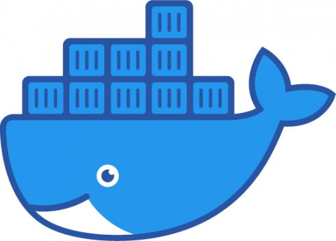
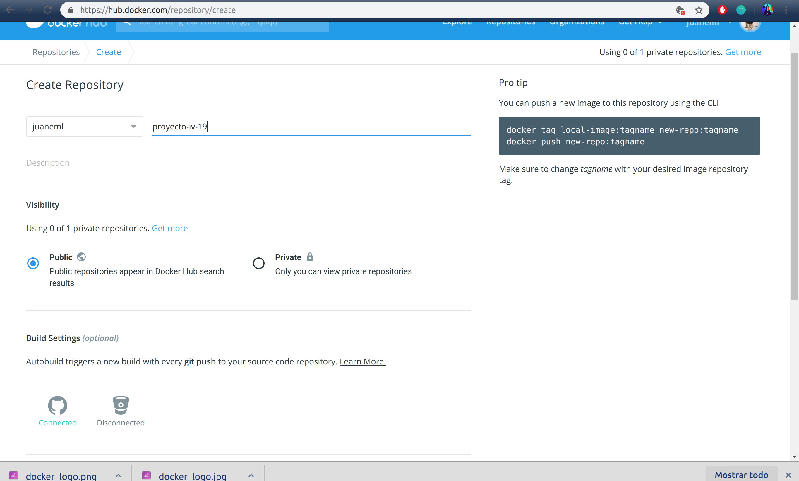
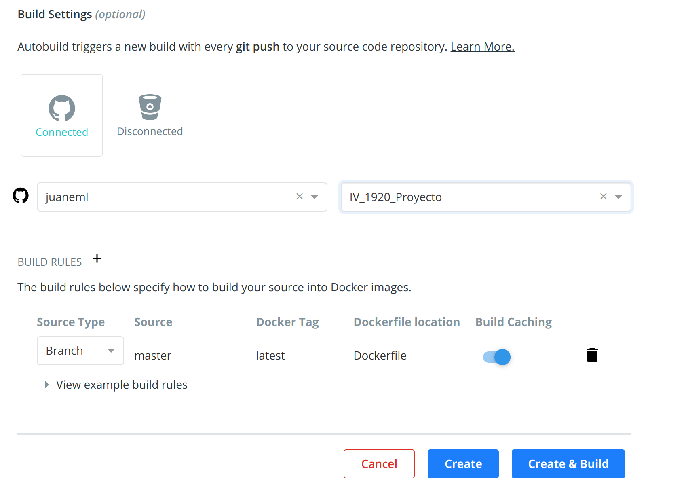
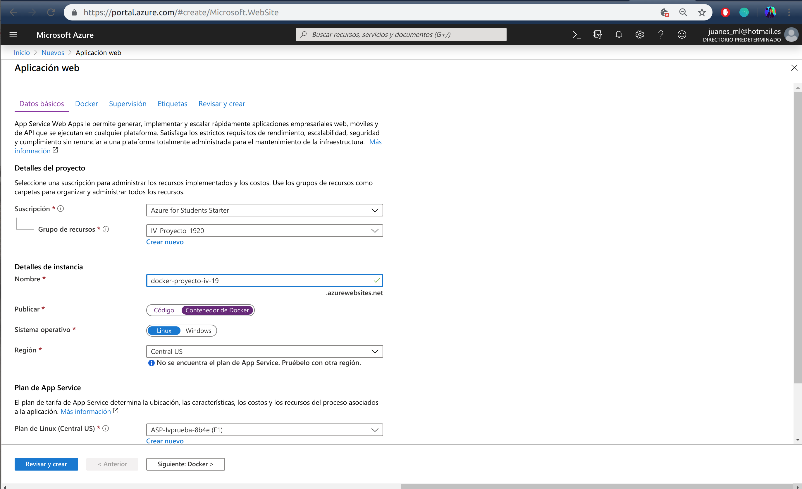
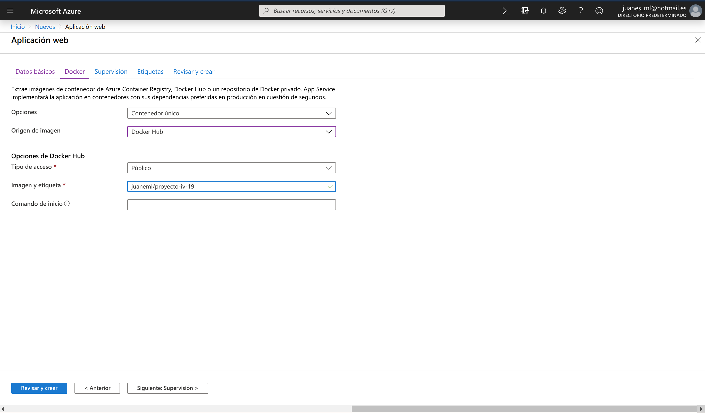
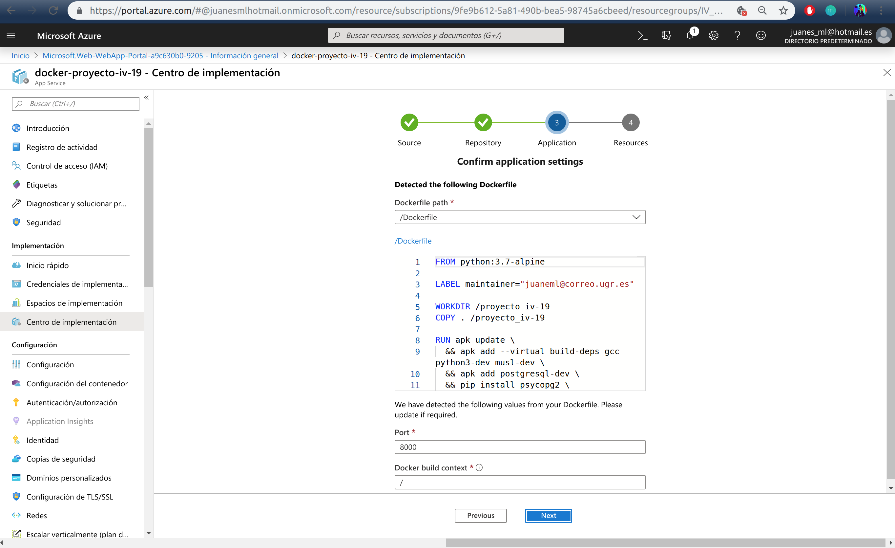
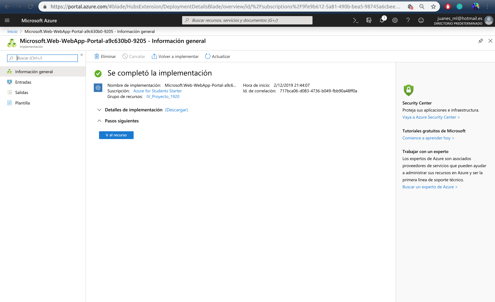
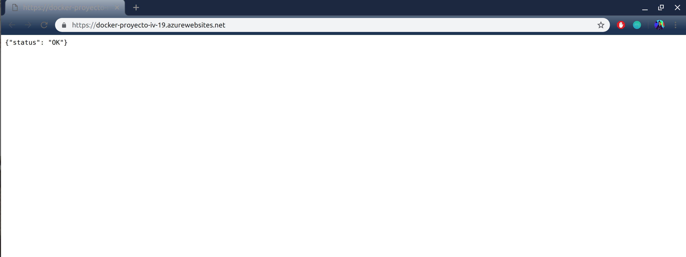

# El despliegue en Docker

- Nos dirigimos a create Repository y creamos un repositorio.

- Elegimos el nombre de nuestro contenedor y la descipción, dejamos la visibilidad pública.
  
- Para la configuración de compilación,build settings, nos conectamos a nuestro repositorio de github. Seleccionamos nuestro usuario y el repositorio que queremos usar.

- Para las reglas de compilación dejamos la que nos viene por defecto, latest, y finalmente create and build.

- Necesitamos crear un fichero con nombre Dockerfile en nuestro repositorio de github, para que docker pueda construir nuestro contenedor, tenemos que especificarle la imagen que vamos a usar, así como las dependencias y requisitos necesarios, para la creación del DockerFile hemos visitado la [documentación](https://hub.docker.com/_/python/).

- El [Dockerfile](../Dockerfile) quedaría tal que así:
  
~~~~
FROM python:3.7-alpine

LABEL maintainer="juaneml@correo.ugr.es"

WORKDIR /proyecto_iv-19
COPY . /proyecto_iv-19

RUN apk update \
  && apk add --virtual build-deps gcc python3-dev musl-dev \
  && apk add postgresql-dev \
  && pip install psycopg2 \
  && apk del build-deps
  
RUN pip3 install --no-cache-dir -r requirements.txt

CMD cd src && gunicorn proyecto_app:__hug_wsgi__ -b 0.0.0.0:8000
EXPOSE 8000/tcp

~~~~

- Se usa `FROM python:3.7-alpine`, porque es una imagen que no pesa demasiado unos 98MB y para nuestra aplicación es suficiente ya que cubre todas las necesidades que necesitamos.

- `LABEL` especificamos el propietario o personal de mantenimiento.

- `WORKDIR` indicamos el directorio de trabajo.

- `COPY . /proyecto_iv-19`, con `COPY .` indicamos a docker que queremos copiar todo el contenido del repositorio en la ruta `proyecto_iv-19`.

- `RUN apk update \
  && apk add --virtual build-deps gcc python3-dev musl-dev \
  && apk add postgresql-dev \
  && pip install psycopg2 \
  && apk del build-deps`,
  con este comando actualizamos y añadimos lo necesario para poder instalar psycopg2 que es necesario para postgresql y que posteriormente se hará uso.

- `Run pip3 install --no-cache-dir -r requeriments.txt` con este comando instalamos las dependencias con `--no-cache-dir` desabilitamos la memoria caché, queremos que nuestro docker ocupe lo mínimo posible.
  
- `CMD cd src && gunicorn proyecto_app:__hug_wsgi__ -b 0.0.0.0:8000`, primero nos situamos en el directorio src donde tenemos el código de nuestra aplicación y luego indicamos que con `gunicorn` lancemos nuestra aplicación en el puerto `8000`.

- `EXPOSE 8000/tcp` finalmente con este comando indicamos que se habilite el puerto 8000 para el protocolo tcp.

## Dockerignore

- Creamos otro fichero [.dockerignore](../.dockerignore) para evitar que se copien ficheros innecesarios tales como los test y las configuraciones para travis y heroku, este fichero es el siguiente:

~~~~
*git
*doc
*test*
*.yml
*circleci*
*github*
*pytest_cache*

Procfile
~~~~

# Imagen de docker
[Docker](https://hub.docker.com/r/juaneml/proyecto-iv-19)

# Desplegamos el contenedor en Heroku

- Para hacer el despliegue hacemos uso de la [documentación](https://devcenter.heroku.com/articles/build-docker-images-heroku-yml) disponible en heroku.

- Necesitamos crear el fichero heroku.yml, este nos permite decirle a Heroku que vamos a crear una imagen a partir del fichero DockerFile.

- Especificamos la imagen de Docker para compilar el proceso web de la aplicación, tanto [heroku.yml](../heroku.yml) como [Dockerfile](../Dockerfile) están en el mismo directorio. Si no se incluye run, Heroku usa el CMD especificado en el Dockerfile.

- Heroku.yml

~~~~
build:
  docker:
    web: Dockerfile
run:
  web: cd src && gunicorn proyecto_app:__hug_wsgi__ --log-file -
~~~~

- Una vez añadido el fichero herokuyml, ejecutamos la orden:

~~~~
heroku stack:set container -a proyecto-iv-19-docker
~~~~

- Indicamos a heroku que es un contenedor y el nombre de la aplicación proyecto-iv-19-docker.

- Por último, actualizamos ejecutando el comando 
~~~~
git push heroku master
~~~~

# Contenedor heroku

[Heroku docker](https://proyecto-iv-19-docker.herokuapp.com/)

salida:
~~~~
{"status": "OK"}
~~~~

# Despliegue en Azure con Docker

- Dentro del portal de Azure, vamos a `Crear un recurso`, Aplicación web, elegimos el grupo de recursos si ya lo teniamos creado o creamos uno, elegimos el nombre de nuestra aplicación, en mi caso `docker-proyecto-iv-19`, en la opción de publicar elegimos la opción de `contenedor de Docker`.

- Luego vamos a la pestaña Docker, elegimos `Contenedor único` en opciones, Origen de imagen `Docker Hub`, el tipo de acceso público ya que es público en docker, y en imagen y etiqueta elegimos la imagen, en mi caso `juaneml/proyecto-iv-19`.

- Vamos a revisar y crear.
- Confirmamos con next.

- Cuando finalice obtendremos esta salida:

Vamos al recurso que hemos creado y ya tendremos nuestra aplicación con docker en azure.

### salida

## Docker azure
[Docker azure](https://docker-proyecto-iv-19.azurewebsites.net/)

