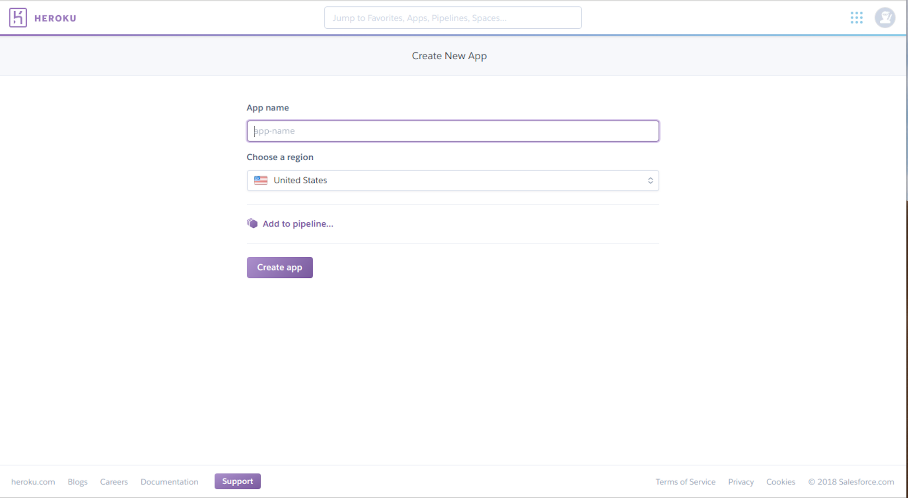
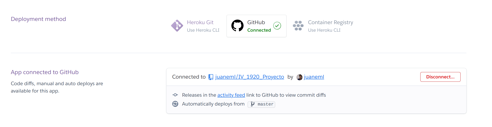

# PaaS Heroku
# Despliegue de aplicación en [heroku](https://www.heroku.com/)

A continuación veremos los pasos para desplegar nuestra aplicación.

## Paso 1:
- Nos registramos en [Heroku](https://www.heroku.com/)
- Elegimos el nombre de nuestra aplicación, en mi caso proyecto-iv

## Paso 2:
- Conectamos nuestra aplicación con nuestro repositorio eh Github

## Paso 3:
- Activamos la opción Wait for CI to pass before deploy, ya que tenemos a Travis para
la ejecución de los tests.

# Adaptamos el proyecto para la ejecución de heroku

- Añadimos los requerimientos en el archivo [requirements.txt](.//../requirements.txt) necesarios en mi caso son los siguientes :
   ~~~~
    Hug==2.6.0
    pytest==5.2.1
    pip==19.2
    PyYAML==5.1.2
    psycopg2==2.8.3
    pipenv
    coverage==4.5.4
    pytest-cov==2.7.1
    python-coveralls==2.9.2
    codecov
    gunicorn==19.5.0
   ~~~~
# Añadimos un nuevo archivo con nombre [Procfile](./../Procfile) con el contenido siguiente:
  ~~~
   web: cd src && gunicorn proyecto-dep-app:__hug_wsgi__ --log-file -
  ~~~

 - Este archivo es necesario para indicarle a Heroku como ejecutar nuestra aplicación, indica que se mueva al directorio donde está la aplicación, directorio src,se indica que el proceso es un proceso web que va a recibir tráfico HTTP y que se ejecute la el fichero Python con nombre proyecto-dep_app,con el servidor web gunicorn ejecute la aplicación de Python que usa como framework hug  con los parámetros __hug_wsgi__ como nos indica la documentación [hug](https://www.hug.rest/website/quickstart) y así integre nuestra aplicación de microservicio.

# Añadimos otro archivo con nombre [runtime.txt](./../runtime.txt) con el contenido siguiente:
~~~~
python-3.7.5 
~~~~
- Que en mi caso especifico la versión de python que uso.
  
 - Así ya tendremos a nuestra aplicación en la plataforma de Heroku.