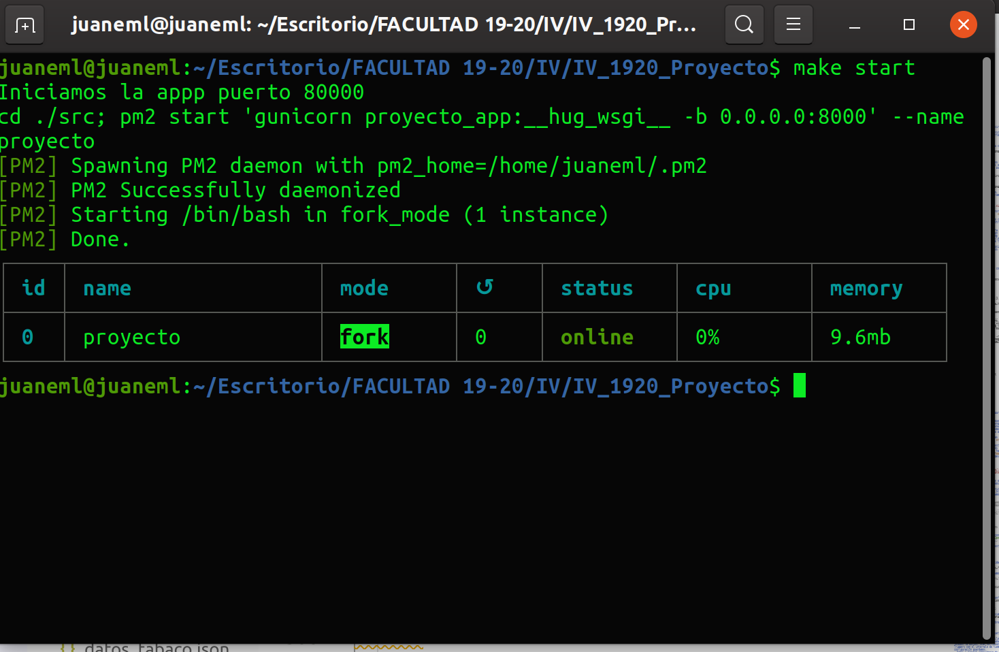
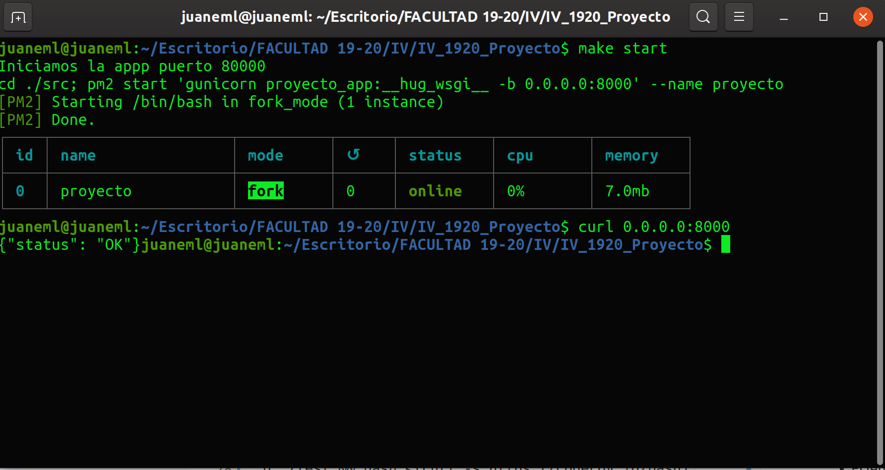
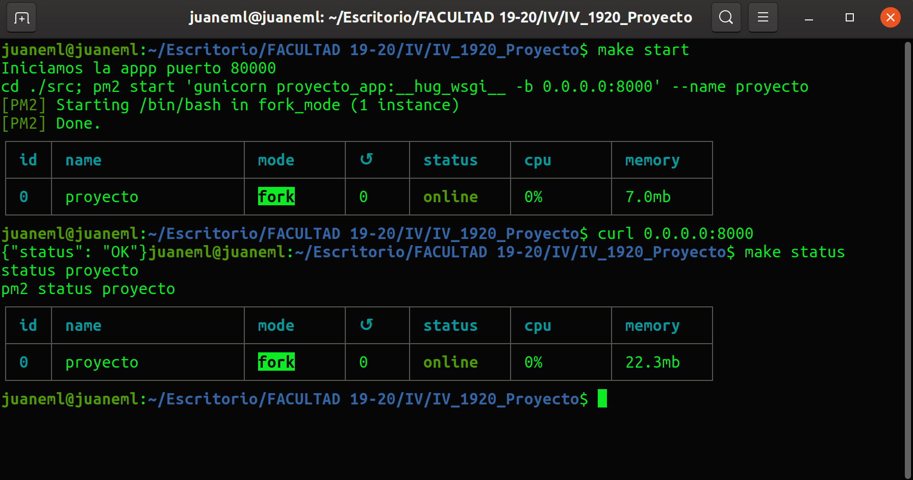
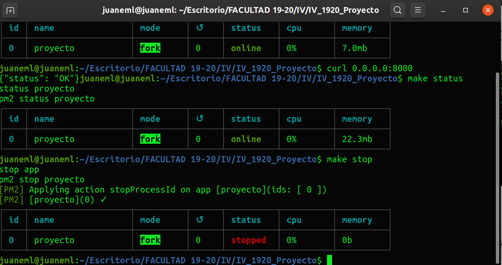

# Herramienta de construcción
- Hemos definido una herramienta de construcción
[Makefile](https://github.com/juaneml/IV_1920_Proyecto/blob/master/Makefile)

~~~
dependences:
	@echo "Makefile microservicio\n"
	@echo "language: python version 3.7 \n"
	

	@cho "npm install and pm2"
	npm install npm-install-all -g
	npm install pm2 -g

	@echo "install dependences"
	pip3 install -r requirements.txt

test: 
	@echo "run tests"
	cd ./test && pytest --cov=test	test.py test_app.py
	cd ./test && coverage run -p --source=test test.py 
	cd ./test && coverage report -m
	cd ./test && coverage xml 
	cd ./test && coverage run -p --source=test_app test_app.py 
	cd ./test && coverage report -m
	cd ./test && coverage xml -o coverage1.xml
	cd ./test && coverage combine
	cd ./test && coverage xml
	
	
codecov:
	@echo "codecov"
	cd ./test && bash <(curl -s https://codecov.io/bash) -t d0ba6a02-f9f7-44ab-b128-a82396d54280 -f coverage.xml
	cd ./test && coveralls

start:
	@echo "Iniciamos la appp puerto 80000"
	cd ./src; pm2 start 'gunicorn proyecto_app:__hug_wsgi__ -b 0.0.0.0:8000' --name proyecto

status:
	@echo "status proyecto"
	pm2 status proyecto

monitor:
	@echo "monitor logs, custom metrics, application information"		
	pm2 monit

stop:
	@echo "stop app"
	pm2 stop proyecto 

logs_repo:
	@echo "logs repo"
	git log > logs_repo.txt

delete:
	@echo "delete proyecto in pm2"
	pm2 delete proyecto

~~~
con las siguientes características:
- Para imprimir mensajes por pantalla hacemos uso de echo. 
  
- dependences:
  - Instalamos el gestor de tareas pm2 pero previamente instalamos npm para poder instalar pm2.
   
  - Instalamos las dependencias necesarias como las que tenemos en requirements.txt
  
- Test: 
    - Lanzará los test y cobertura del código así como dos reportes xml después los combinaremos con ` coverage combine`.
    - Vamos a explicar las opciones puestas en coverage.
    - `coverage run -p --source=test`, `-p` nos permite combinarlo con otro reporte, `-source` determinamos el código al que queremos hacer la cobertura sin .py y por último el `archivo.py`.

    - Tenemos dos test:
    - [test.py](/test/test.py) hace test al código python necesario para nuestro servicio
    - [test_app.py](/test/test_app.py), se aplican test al servicio, haciendo uso de nuestro [Framework Hug](https://www.hug.rest/), como la comprobación de que se muestra el contenido deseado en las distintas urls definidas.
    
- codecov:
  - Tendremos la cobertura de nuestro código, es decir el uso que se ha obtenido del código que queremos aplicar la cobertura, en nuestro caso los test.
  - 

- start: 
  - Inicia con el gestor de tareas pm2 y con gunicorn, una herramienta que nos permite desplegar de forma local nuestra aplicación.

  - Lanzamos nuestra aplicación: `cd ./src; pm2 start 'gunicorn proyecto_app:__hug_wsgi__ -b 0.0.0.0:8000' --name proyecto`
  
  ~~~
    make start
  ~~~

  

  - Comprobamos que funciona: `curl <url:puerto>`
  ~~~
  curl 0.0.0.0:8000
  ~~~

  
 

  - Comprobamos el estado del servicio: `pm2 status proyecto` 
  ~~~
  make status
  ~~~
  

  
 
   
  - Paramos el servicio: `pm2 stop proyecto`
  
  ~~~
    make stop
  ~~~

    

  - Borramos el servicio: `pm2 delete proyect`
- 
  - logs_repo, nos mostrará los logs del repositorio 
   ~~~
    make logs_repo 
   ~~~

