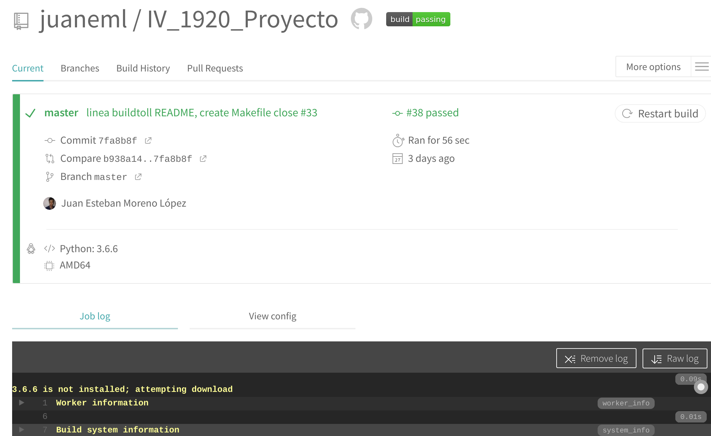

## [Travis](https://travis-ci.org/) 

- Servicio que proporciona la integración continua.
  - Este servicio permite ejecutar tests de nuestro repositorio en Github.
  - Los pasos son muy sencillos y son:
    - Nos registramos con nuestra cuenta de Github.
    - Creamos en el repositorio donde queremos tener la integración continua un archivo con el nombre [.travis.yml](https://github.com/juaneml/IV_1920_Proyecto/blob/master/.travis.yml),

    Fichero .travis.yml
    ~~~
    language: python

      python:
        - "3.7"

      # command to install dependencies
      install:
        - make dependences

      services:
        - postgresql
          
      before_script:
        - psql -c 'create database travis_ci_test;' -U postgres
        
      
      # command to run tests
      script: 
        - make start
        - make status
        - make -B test
      

      after_success:
        - make stop
        - make delete

        - cd ./test 
        - bash <(curl -s https://codecov.io/bash) -f coverage.xml
        - coveralls

    ~~~     
     
  - Vamos a describir este archivo:
    - language: lenguage de programación usado, en mi caso [python](https://www.python.org/), versión 3.7. 
    - Los comandos para instalar las depencecias:
      - con pip3 install instalamos:
        - [requirements.txt](https://github.com/juaneml/IV_1920_Proyecto/blob/master/requirements.txt),requisitos que necesitamos.
        - [codecov](https://codecov.io/), una herramienta de integración para comparar la cobertura de nuestro código.
        - [coverage](https://coverage.readthedocs.io/en/v4.5.x/), para medir la cobertura de los programas programados en python, nos permitirá ver el seguimiento del uso de las distintas funciones, es decir el uso en la aplicación de los distintos test.
        - [coveralls](https://coveralls.io/), otra herramienta para la cobertura de nuestro código, que posteriormente se hará uso.
        - y por último incluimos la instrucción de pytest para la ejecución de test de nuestro proyecto.
        - Se activa el servicio de postgreSql que posteriormente se hará uso.
        - Con ***psql -c***  , se crea una base de datos.
        - pytest para el uso de test.
        - coverage run nombre del test, para aplicar la cobertura a nuestro test.
        - coverage report -m, que nos mostrará la cobertura de nuestro código
        - coverage xml, para crear nuestro reporte.
        - bash <(curl -s https://codecov.io/bash) -t codec_token -f nombre_archivo.xml para subir nuestro reporte y poder seguirlo en la la web de [codecov](https://codecov.io/).
        
    - Una vez configurado nuestro archivo .travis.yml vamos a la web de travis.   
    - En el panel de Travis activamos nuestro proyecto
     
    
    - En la pestaña Dashboard podremos ver nuestro repositorio activo.
    - Para poder verlo con más detalle lo seleccionamos y veremos si ha ido todo bien o hemos tenido algún error.
    - Si todo ha ido bien tendremos una salida como esta:

   
